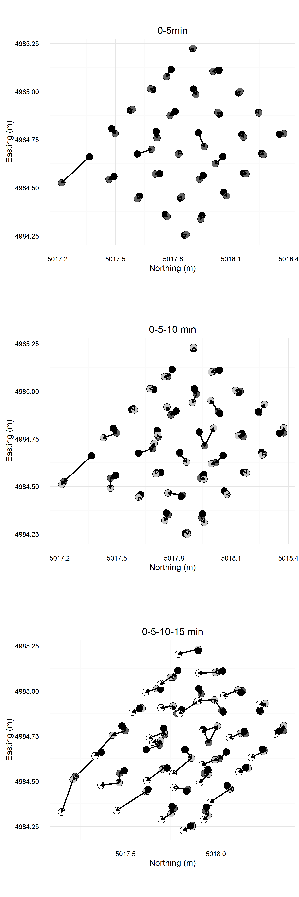

```{r load_libraries, echo = FALSE}
library(knitr)
opts_chunk$set(echo = FALSE, 
               messages = FALSE, 
               warnings = FALSE, 
               dpi = 300,
               cache = TRUE)
suppressPackageStartupMessages(library(dplyr, quietly = TRUE))
suppressPackageStartupMessages(library(ggplot2, quietly = TRUE))
suppressPackageStartupMessages(library(gridExtra, quietly = TRUE))
library(readxl)
library(stringr)
library(grid)
options(warn=-1)
# image width should be 90 mm for 1 col, 140 mm for 1.5 col, 190mm for two cols
```

```{r load_data}
# enter lithic metric data

tramp <- read_excel("../data/trampling_exp.xlsx")

# Load total station data
points <- read.csv("../data/trampling.csv")
```

```{r split_by_trampling_event}
# split string from total station point description
# split out the description between dashes or underscores
points$Description <- as.character(points$Description)
points$code <- (strsplit(points$Description, "-|_"))
points$type <- sapply(points$code, "[", 1) 
points$square <- sapply(points$code, "[", 2)
points$run <- sapply(points$code, "[", 3)
points$artefact <- as.numeric(as.character(sapply(points$code, "[", 4)))
# points$coords <- paste(points$Northing, points$Easting, points$Elevation, sep = "-")
points$artefactNum <- sequence(rle(points$Description)$lengths)
# points <- points[,-c(1:4)]

# reshape to put multiple points of one artefact on one line
points.r <- reshape(points, direction = "wide", timevar = "artefactNum", idvar = "Description")

# make separate tables of point data 
# for before, five min, ten min and fifteen min
before  <- points.r[points.r$run.1 == "B",]
five    <- points.r[points.r$run.1 == "A5",]
ten     <- points.r[points.r$run.1 == "A10",]
fifteen <- points.r[points.r$run.1 == "A15",]

# fifteen is missing an artefact, find which one and replace
# sort(fifteen$artefact.1)
# sort(ten$artefact.1)
# fifteen in missing artefact 35, check to see
# points[points$artefact == 35,]
# indeed it is... replace 35 with same data as ten mins
fifteen <- rbind(fifteen, ten[ten$artefact.1 == 35,])

# separate artefacts with one point, two points and four points
before1 <- before[before$code.2 == 'NULL',]
five1 <- five[five$code.2 == 'NULL',]
ten1 <- ten[ten$code.2 == 'NULL',]
fifteen1 <- fifteen[fifteen$code.2 == 'NULL',]

# ten1 does not have 12 artefacts
# sort(five1$artefact.1)
# sort(ten1$artefact.1)
# missing 58, replace with same data as five mins
ten1 <- rbind(ten1, five1[five1$artefact.1 == 58,])


# now two points per artefact
before2 <- before[before$code.2 != 'NULL' & before$code.3 == 'NULL',]
five2 <- five[five$code.2 != 'NULL' & five$code.3 == 'NULL',]
ten2 <- ten[ten$code.2 != 'NULL' & ten$code.3 == 'NULL',]
fifteen2 <- fifteen[fifteen$code.2 != 'NULL' & fifteen$code.3 == 'NULL',]

# ten2 has too many artefacts....
# sort(five2$artefact.1)
# sort(ten2$artefact.1)
# delete artefact 58, not sure why that's there. 
ten2 <- ten2[ten2$artefact.1 != 58,]

# now four points per artefact
before4 <- before[before$code.3 != 'NULL' & before$code.4 != 'NULL',]
five4 <- five[five$code.3 != 'NULL' & five$code.4 != 'NULL',]
ten4 <- ten[ten$code.3 != 'NULL' & ten$code.4 != 'NULL',]
fifteen4 <- fifteen[fifteen$code.3 != 'NULL' & fifteen$code.4 != 'NULL',]

# how many artefacts in the experiment...

# had two points recorded?
two_dims <- five2 %>% summarize(n = n())
# had four points recorded?
four_dims <- five4  %>%   summarize(n = n())
```

```{r prepare_point_data}

####### find the x and y distances between zero and five min ########
# match up the artefacts, then subtract B from A5
# for artefacts plotted with a single point
five1diff <- merge(before1, five1, by = "artefact.1")
# horizontal displacement distance
five1diff$hor <- with(five1diff, sqrt( (Northing.1.y - Northing.1.x)^2 + (Easting.1.y - Easting.1.x)^2 ) )
# vertical displacement distance
five1diff$ver <- with(five1diff, (Elevation.1.y - Elevation.1.x))
# total length of displacement vector
five1diff$tot <- with(five1diff, sqrt( (Northing.1.y - Northing.1.x)^2 + (Easting.1.y - Easting.1.x)^2 + (Elevation.1.y - Elevation.1.x)^2) )
# direction of displacement

# for artefacts plotted with two points
five2diff <- merge(before2, five2, by = "artefact.1")
# get a centre coord for calculating displacements
five2diff$B.centre.N <- apply(cbind(five2diff$Northing.1.x, five2diff$Northing.2.x), 1, mean)
five2diff$B.centre.E <- apply(cbind(five2diff$Easting.1.x, five2diff$Easting.2.x), 1, mean)
five2diff$B.centre.Z <- apply(cbind(five2diff$Elevation.1.x, five2diff$Elevation.2.x), 1, mean)
five2diff$A5.centre.N <- apply(cbind(five2diff$Northing.1.y, five2diff$Northing.2.y), 1, mean)
five2diff$A5.centre.E <- apply(cbind(five2diff$Easting.1.y, five2diff$Easting.2.y), 1, mean)
five2diff$A5.centre.Z <- apply(cbind(five2diff$Elevation.1.y, five2diff$Elevation.2.y), 1, mean)
# horizontal displacement distance
five2diff$hor <- with(five2diff, sqrt( (A5.centre.N - B.centre.N)^2 + (A5.centre.E - B.centre.E)^2 ) )
# vertical displacement distance
five2diff$ver <- with(five2diff, (B.centre.Z - A5.centre.Z))
# total length of displacement vector
five2diff$tot <- with(five2diff, sqrt( (A5.centre.N - B.centre.N)^2 + (A5.centre.E - B.centre.E)^2 + (B.centre.Z - A5.centre.Z)^2) )
# direction of displacement

# for artefacts plotted with four points
five4diff <- merge(before4, five4, by = "artefact.1")
# get a centre coord for calculating displacements
five4diff$B.centre.N <- apply(cbind(five4diff$Northing.1.x, five4diff$Northing.2.x, five4diff$Northing.3.x, five4diff$Northing.4.x), 1, mean)
five4diff$B.centre.E <- apply(cbind(five4diff$Easting.1.x, five4diff$Easting.2.x, five4diff$Easting.3.x, five4diff$Easting.4.x), 1, mean)
five4diff$B.centre.Z <- apply(cbind(five4diff$Elevation.1.x, five4diff$Elevation.2.x, five4diff$Elevation.3.x, five4diff$Elevation.4.x), 1, mean)
five4diff$A5.centre.N <- apply(cbind(five4diff$Northing.1.y, five4diff$Northing.2.y, five4diff$Northing.3.y, five4diff$Northing.4.y), 1, mean)
five4diff$A5.centre.E <- apply(cbind(five4diff$Easting.1.y, five4diff$Easting.2.y, five4diff$Easting.3.y, five4diff$Easting.4.y), 1, mean)
five4diff$A5.centre.Z <- apply(cbind(five4diff$Elevation.1.y, five4diff$Elevation.2.y, five4diff$Elevation.3.y, five4diff$Elevation.4.y), 1, mean)
# horizontal displacement distance
five4diff$hor <- with(five4diff, sqrt( (A5.centre.N - B.centre.N)^2 + (A5.centre.E - B.centre.E)^2 ) )
# vertical displacement distance
five4diff$ver <- with(five4diff, (B.centre.Z - A5.centre.Z))
# total length of displacement vector
five4diff$tot <- with(five4diff, sqrt( (A5.centre.N - B.centre.N)^2 + (A5.centre.E - B.centre.E)^2 + (B.centre.Z - A5.centre.Z)^2) )
# direction of displacement

# summary for zero to five mins
fivehor <- c(five1diff$hor, five2diff$hor, five4diff$hor)
fivever <- c(five1diff$ver, five2diff$ver, five4diff$ver)
fivetot <- c(five1diff$tot, five2diff$tot, five4diff$tot)
fivesum <- data.frame(cbind(fivehor, fivever, fivetot))

####### find the x and y distances between zero and ten min ########
# match up the artefacts, then subtract B from A5
# for artefacts plotted with a single point
ten1diff <- merge(before1, ten1, by = "artefact.1", all.x = FALSE)
# horizontal displacement distance
ten1diff$hor <- with(ten1diff, sqrt( (Northing.1.y - Northing.1.x)^2 + (Easting.1.y - Easting.1.x)^2 ) )
# vertical displacement distance
ten1diff$ver <- with(ten1diff, (Elevation.1.y - Elevation.1.x))
# total length of displacement vector
ten1diff$tot <- with(ten1diff, sqrt( (Northing.1.y - Northing.1.x)^2 + (Easting.1.y - Easting.1.x)^2 + (Elevation.1.y - Elevation.1.x)^2) )
# direction of displacement

# for artefacts plotted with two points
ten2diff <- merge(before2, ten2, by = "artefact.1", all.y = TRUE)
# if two of these points are more than 5 cm apart, we have a bad field measurement, since no artefact was that big. So let's check

# ten2diff$B.dif.N <- ten2diff$Northing.1.x - ten2diff$Northing.2.x
# ten2diff$B.dif.E <- ten2diff$Easting.1.x - ten2diff$Easting.2.x
# ten2diff$B.dif.Z <- ten2diff$Elevation.1.x - ten2diff$Elevation.2.x
# 
# ten2diff$A10.dif.N <- ten2diff$Northing.1.y - ten2diff$Northing.2.y
# ten2diff$A10.dif.E <- ten2diff$Easting.1.y - ten2diff$Easting.2.y
# ten2diff$A10.dif.Z <- ten2diff$Elevation.1.y - ten2diff$Elevation.2.y

# they are all ok

# get a centre coord for calculating displacements
ten2diff$B.centre.N <- apply(cbind(ten2diff$Northing.1.x, ten2diff$Northing.2.x), 1, mean)
ten2diff$B.centre.E <- apply(cbind(ten2diff$Easting.1.x, ten2diff$Easting.2.x), 1, mean)
ten2diff$B.centre.Z <- apply(cbind(ten2diff$Elevation.1.x, ten2diff$Elevation.2.x), 1, mean)
ten2diff$A5.centre.N <- apply(cbind(ten2diff$Northing.1.y, ten2diff$Northing.2.y), 1, mean)
ten2diff$A5.centre.E <- apply(cbind(ten2diff$Easting.1.y, ten2diff$Easting.2.y), 1, mean)
ten2diff$A5.centre.Z <- apply(cbind(ten2diff$Elevation.1.y, ten2diff$Elevation.2.y), 1, mean)
# horizontal displacement distance
ten2diff$hor <- with(ten2diff, sqrt( (A5.centre.N - B.centre.N)^2 + (A5.centre.E - B.centre.E)^2 ) )
# vertical displacement distance
ten2diff$ver <- with(ten2diff, (B.centre.Z - A5.centre.Z))
# total length of displacement vector
ten2diff$tot <- with(ten2diff, sqrt( (A5.centre.N - B.centre.N)^2 + (A5.centre.E - B.centre.E)^2 + (B.centre.Z - A5.centre.Z)^2) )
# direction of displacement

# for artefacts plotted with four points
ten4diff <- merge(before4, ten4, by = "artefact.1")

# get a centre coord for calculating displacements
ten4diff$B.centre.N <- apply(cbind(ten4diff$Northing.1.x, ten4diff$Northing.2.x, ten4diff$Northing.3.x, ten4diff$Northing.4.x), 1, mean)
ten4diff$B.centre.E <- apply(cbind(ten4diff$Easting.1.x, ten4diff$Easting.2.x, ten4diff$Easting.3.x, ten4diff$Easting.4.x), 1, mean)
ten4diff$B.centre.Z <- apply(cbind(ten4diff$Elevation.1.x, ten4diff$Elevation.2.x, ten4diff$Elevation.3.x, ten4diff$Elevation.4.x), 1, mean)
ten4diff$A5.centre.N <- apply(cbind(ten4diff$Northing.1.y, ten4diff$Northing.2.y, ten4diff$Northing.3.y, ten4diff$Northing.4.y), 1, mean)
ten4diff$A5.centre.E <- apply(cbind(ten4diff$Easting.1.y, ten4diff$Easting.2.y, ten4diff$Easting.3.y, ten4diff$Easting.4.y), 1, mean)
ten4diff$A5.centre.Z <- apply(cbind(ten4diff$Elevation.1.y, ten4diff$Elevation.2.y, ten4diff$Elevation.3.y,ten4diff$Elevation.4.y), 1, mean)
# horizontal displacement distance
ten4diff$hor <- with(ten4diff, sqrt( (A5.centre.N - B.centre.N)^2 + (A5.centre.E - B.centre.E)^2 ) )
# vertical displacement distance
ten4diff$ver <- with(ten4diff, (B.centre.Z - A5.centre.Z))
# total length of displacement vector
ten4diff$tot <- with(ten4diff, sqrt( (A5.centre.N - B.centre.N)^2 + (A5.centre.E - B.centre.E)^2 + (B.centre.Z - A5.centre.Z)^2) )
# direction of displacement

# summary for zero to ten mins
tenhor <- c(ten1diff$hor, ten2diff$hor, ten4diff$hor)
tenver <- c(ten1diff$ver, ten2diff$ver, ten4diff$ver)
tentot <- c(ten1diff$tot, ten2diff$tot, ten4diff$tot)
tensum <- data.frame(cbind(tenhor, tenver, tentot))

####### find the x and y distances between zero and fifteen min ########
# match up the artefacts, then subtract B from A5
# for artefacts plotted with a single point
fifteen1diff <- merge(before1, fifteen1, by = "artefact.1")
# horizontal displacement distance
fifteen1diff$hor <- with(fifteen1diff, sqrt( (Northing.1.y - Northing.1.x)^2 + (Easting.1.y - Easting.1.x)^2 ) )
# vertical displacement distance
fifteen1diff$ver <- with(fifteen1diff, (Elevation.1.y - Elevation.1.x))
# total length of displacement vector
fifteen1diff$tot <- with(fifteen1diff, sqrt( (Northing.1.y - Northing.1.x)^2 + (Easting.1.y - Easting.1.x)^2 + (Elevation.1.y - Elevation.1.x)^2) )
# direction of displacement

# for artefacts plotted with two points
fifteen2diff <- merge(before2, fifteen2, by = "artefact.1")
# get a centre coord for calculating displacements
fifteen2diff$B.centre.N <- apply(cbind(fifteen2diff$Northing.1.x, fifteen2diff$Northing.2.x), 1, mean)
fifteen2diff$B.centre.E <- apply(cbind(fifteen2diff$Easting.1.x, fifteen2diff$Easting.2.x), 1, mean)
fifteen2diff$B.centre.Z <- apply(cbind(fifteen2diff$Elevation.1.x, fifteen2diff$Elevation.2.x), 1, mean)
fifteen2diff$A5.centre.N <- apply(cbind(fifteen2diff$Northing.1.y, fifteen2diff$Northing.2.y), 1, mean)
fifteen2diff$A5.centre.E <- apply(cbind(fifteen2diff$Easting.1.y, fifteen2diff$Easting.2.y), 1, mean)
fifteen2diff$A5.centre.Z <- apply(cbind(fifteen2diff$Elevation.1.y, fifteen2diff$Elevation.2.y), 1, mean)
# horizontal displacement distance
fifteen2diff$hor <- with(fifteen2diff, sqrt( (A5.centre.N - B.centre.N)^2 + (A5.centre.E - B.centre.E)^2 ) )
# vertical displacement distance
fifteen2diff$ver <- with(fifteen2diff, (B.centre.Z - A5.centre.Z))
# total length of displacement vector
fifteen2diff$tot <- with(fifteen2diff, sqrt( (A5.centre.N - B.centre.N)^2 + (A5.centre.E - B.centre.E)^2 + (B.centre.Z - A5.centre.Z)^2) )
# direction of displacement

# for artefacts plotted with four points
fifteen4diff <- merge(before4, fifteen4, by = "artefact.1")
# get a centre coord for calculating displacements
fifteen4diff$B.centre.N <- apply(cbind(fifteen4diff$Northing.1.x, fifteen4diff$Northing.2.x, fifteen4diff$Northing.3.x, fifteen4diff$Northing.4.x), 1, mean)
fifteen4diff$B.centre.E <- apply(cbind(fifteen4diff$Easting.1.x, fifteen4diff$Easting.2.x, fifteen4diff$Easting.3.x, fifteen4diff$Easting.4.x), 1, mean)
fifteen4diff$B.centre.Z <- apply(cbind(fifteen4diff$Elevation.1.x, fifteen4diff$Elevation.2.x, fifteen4diff$Elevation.3.x, fifteen4diff$Elevation.4.x), 1, mean)
fifteen4diff$A5.centre.N <- apply(cbind(fifteen4diff$Northing.1.y, fifteen4diff$Northing.2.y, fifteen4diff$Northing.3.y, fifteen4diff$Northing.4.y), 1, mean)
fifteen4diff$A5.centre.E <- apply(cbind(fifteen4diff$Easting.1.y, fifteen4diff$Easting.2.y, fifteen4diff$Easting.3.y, fifteen4diff$Easting.4.y), 1, mean)
fifteen4diff$A5.centre.Z <- apply(cbind(fifteen4diff$Elevation.1.y, fifteen4diff$Elevation.2.y, fifteen4diff$Elevation.3.y, fifteen4diff$Elevation.4.y), 1, mean)
# horizontal displacement distance
fifteen4diff$hor <- with(fifteen4diff, sqrt( (A5.centre.N - B.centre.N)^2 + (A5.centre.E - B.centre.E)^2 ) )
# vertical displacement distance
fifteen4diff$ver <- with(fifteen4diff, (B.centre.Z - A5.centre.Z))
# total length of displacement vector
fifteen4diff$tot <- with(fifteen4diff, sqrt( (A5.centre.N - B.centre.N)^2 + (A5.centre.E - B.centre.E)^2 + (B.centre.Z - A5.centre.Z)^2) )
# direction of displacement

# summary for zero to fifteen mins
fifteenhor <- c(fifteen1diff$hor, fifteen2diff$hor, fifteen4diff$hor)
fifteenver <- c(fifteen1diff$ver, fifteen2diff$ver, fifteen4diff$ver)
fifteentot <- c(fifteen1diff$tot, fifteen2diff$tot, fifteen4diff$tot)
fifteensum <- data.frame(cbind(fifteenhor, fifteenver, fifteentot))

```

# Introduction

Claims for the first evidence of human activity, or of new types of activity, at many archaeological sites depend on a close stratigraphic association between culturally modified materials and dated materials. To be confident of these associations we need a robust understanding of the process of artefacts displacement from their original locations due to post-depositional processes. Examples of problematic vertical separation of artefacts that complicate the interpretation of archaeological deposits have been known for some time. For example, Villa and Courtin [-@villa1983267] describe conjoinable artefacts up to 1 m vertically apart and in different deposits. Similarly, Cahen and Moeyersons [-@cahen1977subsurface] report refitting artefacts up with to 1 m of vertical separation at Gombe Point in Zaire. At FxJj50, Koobi Fora, Kenya, Bunn et al. [-@bunn1980] report conjoinable pieces up to 50 cm apart vertically in brief occupation deposits of alluvial sandy silt. At Cave Spring, Tenessee, Hofman [-@hofman1986vertical] recorded refitting artefacts over 20-40 cm of vertical distance. Richardson [-@Richardson1992] observed a maximum vertical separation of 30 cm for conjoining artefacts from different excavation units at Kenniff Cave (Queensland, Australia). In this paper we use geological methods to explore clast shape and size metrics to identify relationships that might help identify artefacts that have moved due to trampling, and given the shape attributes of an assemblage, to understand the magnitude of movement that may have occurred in an assemblage.     

Our motivation for this study arises from claims of vertical movement of artefacts in debates surrounding the timing of the first human occupation of Sahul, where the archaeological deposits are often sandy and lacking well-defined stratigraphy. Investigations at archaeological sites in northern Australia recovered small numbers of flaked stone artefacts from sandy rockshelter deposits associated with Optically Stimulated Luminescence ages (OSL) 50-60 k BP. The reliability of these associations has been questioned, with critics claiming that post-depositional processes have brought the stone artefacts in association with much older sediments. At Madjedbebe (formerly Malakunanja II), one of Australia's oldest sites, trampling of artefacts has been frequently proposed as a possible cause of dislocation of artefacts through down through the deposit into an association with sediments much older than the artefacts. In this paper we describe a trampling experiment directly relevant to Madjedbebe and other sites with sandy deposits in coastal or desert environments. 

Because of the importance of their effect on the understanding artefact contexts and associations, trampling experiments are a mainstay of archaeological science. For example, Eren et al. [-@eren2010experimental] summarised fourteen publications of trampling experiments, all aimed at understanding how human and animal trampling contribute to the spatial  displacement of, and damage to, object commonly found in archaeological sites. The aim of our experiment was to understand how artefacts move in a sandy deposit when trampled by walking. Specifically, we explored the relationship between artefact shape parameters and the distance they were moved by trampling. We follow Eren et al. [-@eren2010experimental] in focusing on short-term trampling events, and by recording the position, orientation and inclination of the artefacts between each trampling event. 

The design of our experiment includes two novel elements not seen in previous trampling studies. First, the substrate for our trampling experiment was the same sediment as the archaeological site that motivated the experiment. A similar experimental setup was used by Benito-Calvo et al. [-@BenitoCalvo2011trampling], who simulated an archaeological sediment fabric by adding clasts to a nearby non-archaeological deposit. In contrast, we conducted our trampling experiment directly on the spoil heaps of archaeological sediment removed during the 2012 excavations at Madjedbebe. The use of site specific archaeological sediment adds a degree of realism to our trampling model. Interactions between the experimental artefact movement and trampling more faithfully resemble what might have happened in the past because we used the archaeological sediments. This ensures a close match for texture and penetrability between the experimental setup and the archaeological site. Our experiment still has many differences from the archaeological contexts; for example, we were not able to exactly match the compaction and fabric, or directional properties, of particular archaeological layers. Furthermore, we cannot be sure of the nature of the archaeological sediment at the time the artefacts were deposited and trampled in prehistory, because post-depositional processes have likely altered the sediment matrix. However, our field observations were that the spoil heaps closely resembled the structure, cohesiveness, permeability and moisture content of the archaeological deposits at Madjedbebe.

Our second novel element is the use of a system for classifying artefact shape that is derived from geological studies of the effect of particle shape on their movement in sediments. Previous studies have used artefact length or mass as a proxy for artefact size to investigate the relationship between size and movement [e.g. @GiffordGonzalez1985; @Nielsen1991trampling]. As Eren et al. [-@eren2010experimental] note, previous studies are not unanimous in demonstrating a relationship between artefact size and movement. This may be because length and mass by themselves are not especially sensitive variables when considering artefact movement. In studying the natural movement of clasts on the landscape, sedimentary geologists have developed a number of shape quantification systems to investigate the transport history of sediments and characterize depositional environments [@Oakey2005grainshape; @Woronow992pebbleshape; @Benn1992pebbleshape; @blott2008particle].  We adopted the simplest of these, the Zingg system, to quantify artefact shape and investigate its relationship with movement resulting from trampling.

# Madjedbebe 

Previously known as Malakanunja II, Madjedbebe is a sandstone rockshelter at the edge of the Magella floodplain in the Northern Territory, Australia. Archaeological excavations were conducted at Madjedbebe in 1973 [@KammingaAllen1973], 1989 [@Roberts1990; @Clarkson2015Madjedbebe], 2012 and 2015. The 1989 excavation produced Thermoluminescence (TL) and OSL ages of 52 $\pm$ 11 and 61 $\pm$ 13 ka associated with the lowest artefacts in the deposit [@Roberts1990]. The nearby site of Nauwalabila returned similar OSL ages, bracketing the ages of the lowest artefacts at between 53 $\pm$ 5 and 60.3 $\pm$ 6 ka [@Roberts1994deaf; @Bird2002Nauwalabila]. These dates were questioned by Hiscock [-@Hiscock1990old] and Bowdler [-@Bowdler1991dates], and later by Allen and O'Connell [-@allen2003colonised] and Allen and O'Connell [-@allen2014both]. We have previously discussed these concerns in detail in Clarkson et al. [-@Clarkson2015Madjedbebe]. Here we focus only on Hiscock's suggestion of the possibility of downward displacement of artefacts into sterile layers through human treadage. 

```{r dates}
dates_1989 <- read.csv("../data/Date_table_from_paper_on_1989_dig.csv")

# function from Clarkson et al 2015 https://github.com/benmarwick/1989-excavation-report-Madjedbebe
tidy_chrono_data <- function(dates_1989){

  # clean up depth, where there's a range, get midpoint
  # get depths with ranges, ie nn-nn
  depthwithrange <- as.character(dates_1989$Depth.cm [grepl("-", dates_1989$Depth.cm )])
  # find midpoint
  midpoint <- unlist(lapply(depthwithrange, function(i) abs(eval(parse(text= i)))))/2 + # get half of range
    as.numeric(gsub("-.*", "", depthwithrange)) # depth value
  # replace depth with range with single depth value
  dates_1989$Depth.cm <- as.character(dates_1989$Depth.cm)
  dates_1989$Depth.cm[grep("-", dates_1989$Depth.cm)] <- midpoint
  dates_1989$Depth.m <- as.numeric(dates_1989$Depth.cm)/100 # in meters

  # get the median value from OxCal output
  oxcal_medians <- read.csv("../data/Date_table_from_paper_on_1989_dig_C14_OxCal_output.csv")

  # get lab sample ID for matching
  matching <- c("R_Date", " ")
  oxcal_medians$Name <- gsub(paste(matching, collapse = "|"), "", oxcal_medians$Name)

  # get rid of spaces and convert to same type
  dates_1989$Lab.Code <- as.character(gsub(" ", "", dates_1989$Lab.Code))
  dates_1989$Method <- as.character(gsub(" ", "", dates_1989$Method))

  dates_1989_with_C14_medians <- merge(x = dates_1989,
                                       y = oxcal_medians,
                                       by.x = "Lab.Code",
                                       by.y = "Name",
                                       all = TRUE)
  # remove header row
  dates_1989_with_C14_medians <- dates_1989_with_C14_medians[-1,]

  # in kya
  dates_1989_with_C14_medians$age2plot <- (ifelse(dates_1989_with_C14_medians$Method == "TL"|dates_1989_with_C14_medians$Method == "OSL", dates_1989_with_C14_medians$Uncalibrated.Age, ifelse(dates_1989_with_C14_medians$Method == "C14"| dates_1989_with_C14_medians$Method == "ABOX", as.numeric(as.character(dates_1989_with_C14_medians$X.3)), NA)))/1000

  # simplify object name
  dates_1989 <- dates_1989_with_C14_medians

  return(dates_1989)

}
# do the tidying
dates_1989_tidy <- tidy_chrono_data(dates_1989)

# function from Clarkson et al 2015 https://github.com/benmarwick/1989-excavation-report-Madjedbebe
interpolate_chrono_data <- function(dates_1989_tidy, depth_of_interest = 200){

  # interpolate age from loess line with depth
  # this is for the lines that show oldest artefact, etc.
  cal.date.lo <- loess(age2plot ~ Depth.m, dates_1989_tidy[dates_1989_tidy$Method %in% c("C14", "TL", "OSL"),] , span = 0.4) # exclude ABOX dates
  cal.date.pr <- predict(cal.date.lo, data.frame(Depth.m = seq(0, 5, 0.01)))
  # plot(cal.date.pr) # just to check
  cal.date.pr <- data.frame(age = cal.date.pr, depth = names(cal.date.pr))
  # determine an age from a known depth
  oldest_depth = 287 # depth in cm, to the nearest 1 cm: oldest artefacts
  oldest <- cal.date.pr[cal.date.pr$depth == oldest_depth,]$age # returns age from loess
  base_of_dense_depth = 250 # depth in cm, to the nearest 1 cm: base of dense artefacts
  dense <- cal.date.pr[cal.date.pr$depth == base_of_dense_depth,]$age # returns age from loess
   # 200 is 20 cm above 53 ka date at 242 cm bs
  age_at_depth_of_interest <- cal.date.pr[cal.date.pr$depth == depth_of_interest,]$age # returns age from loess
   

  return(list(oldest_depth = oldest_depth,
              oldest = oldest,
              base_of_dense_depth = base_of_dense_depth,
              dense = dense,
              depth_of_interest = depth_of_interest, 
              age_at_depth_of_interest = age_at_depth_of_interest,
              cal.date.lo = cal.date.lo))
}

minimum_age_if_trampled <- interpolate_chrono_data(dates_1989_tidy, depth_of_interest=200)

```

Hiscock cited previous work [e.g. @stockton1973shaw] that documented vertical movement of artefacts up to 16 cm. If movements of this magnitude are common in sandy deposits such as Madjedbebe, then the artefacts associated with the 52 and 61 ka BP ages may have originally been deposited on a much younger occupational surface, and then been displaced downward into older deposits that are unrelated to human occupation. Hiscock's suggestion is that, for example, an artefact at the level of the 52 ka age, 242 cm below the surface, may have originally been deposited during occupation at c. 200 cm below. Using a loess regression on the ages published in Clarkson et al. [-@Clarkson2015Madjedbebe], we can interpolate a calibrated age of `r round(minimum_age_if_trampled$age_at_depth_of_interest, 1)` ka BP for 200 cm below the surface. The difference in age of `r formatC((52 -  round(minimum_age_if_trampled$age_at_depth_of_interest, 0)) * 1000, big.mark=",",format="f", drop0trailing = TRUE)` years between 242 and 200 cm below the surface is substantial, and the ages at each depth have very different implications for how we interpret the stone artefact assemblage. 

Previously, we reported on two factors that suggest this kind of downward displacement has not been extensive at Madjedbebe [@Clarkson2015Madjedbebe]. First, we noted that there are several artefacts found within the same excavation unit that conjoin. We take these conjoins as evidence that downward displacement has had only a small effect on this assemblage. Second, we showed that there are clear changes in the abundance of raw materials over time. These changes would be heavily obscured if there was substantial downward displacement of artefacts at Madjedbebe. We believe it is unlikely that the all the artefacts associated with the 52 ka age are actually `r round(minimum_age_if_trampled$age_at_depth_of_interest, 1)` ka old. However, we recognise the potential for artefact movement at the scale described by Hiscock, and with this experiment we intended to get a better understanding of what components of the lithic assemblage are most susceptible to this kind of downward displacement, and how much of the assemblage was displaced to this extent. 

# Materials and methods 

## Lithic assemblage

We collected nodules of white quartz from the landscape and used hard-hammer direct percussion to remove flakes, following a multi-platform reduction pattern. Quartz nodules occur in the local sandstone scarp formation. Quartz artefacts are abundant in the archaeological deposit, especially in the Holocene levels. We selected 30 flakes for the experiment, spray-painted the artefacts bright orange and numbered them to make them easy to identify after each trampling event. Metric data from the artefacts recovered in 1989 are not available, but we produced the artefacts to be within the size range of the artefacts we were recovering from the 2012 excavations (analysis of these artefacts is in progress). 

## Shape measurement 

The overall shape of a clastic particle, such an artefact, is difficult to conveniently reduce to a single measurement with precision and accuracy. In attempting to summarise an artefact's shape, archaeologists have developed a variety of methods for producing multivariate descriptions of artefact shape in two- and three-dimensions [eg. @Grosman2008threedscanning; @Lycett2006crossbeam]. While these methods have provided insights into reduction strategies and assemblage comparison, they require specialised equipment (such as a three-dimensional scanner or photogrammetry equipment) that was not available to us for our experiment. Instead, we used linear measurements of artefacts obtained with vernier calipers to compute indices of artefact shape. These linear measurements can be used with the Zingg system to summarize artefact shape. Although there is extensive discussion on the question of the best clast shape classification method amongst geologists, there is little agreement [@Woronow992pebbleshape; @blott2008particle]. We chose the Zingg because it is the simplest and most widely used shape classification system for geological clasts (Figure \@ref(fig:zinggschematic)). 

```{r zinggschematic, fig.cap="Schematic of the Zingg classification of geological clast shape"}
# I made this image in Inkscape
knitr::include_graphics("../figures/zingg/drawing.png")

```

```{r zinggplotofartefacts, fig.cap="Left: Zingg Diagram classifying the shape of the experimental artefacts. Right: Starting locations of the experimental artefacts before trampling. Numbers on the plots indicate the artefact identification number", fig.width=10}
# compute Zingg values --------

# calculate Zingg's shape values
tramp$elong <- with(tramp, (`width(mm)` / `length(mm)`))
tramp$flat <- with(tramp, (`thickness(mm)` / `width(mm)`))
tramp$shape <- with(tramp, ( flat / elong))

# rename and compute some variables
tramp$vol <- with(tramp, (`length(mm)` * `width(mm)` * `thickness(mm)`))
tramp$volume <- log(tramp$vol)
tramp$elongation <- tramp$elong
tramp$flatness <- tramp$flat
tramp$sphericity <- with(tramp, ((`width(mm)` * `thickness(mm)`)/`length(mm)`^2))^1/3

# plot Zingg values --------
library(ggplot2)
library(ggrepel)

s <- 3 # text size for Zingg's shape

artefact_zingg <- 
ggplot(tramp[1:30,], aes(flat, 
                         elong, 
                         label = artefact)) +
  geom_point(aes(size = shape),
             alpha = 0.3) +
  geom_text_repel(size = I(s)) +
  geom_vline(xintercept = 0.67) +
  geom_hline(yintercept = 0.67) +
  annotate("text", 
           label = "oblate\n(discoidal)",
           x=0.5, 
           y=0.9, 
           colour = "red",
           size = I(s)) +
  annotate("text", 
           label = "equiaxial\n(spheroidal)", 
           x=0.9,
           y=0.9,
           colour = "red",
           size = I(s)) +
  annotate("text", 
           label = "triaxial\n(bladed)", 
           x=0.5, 
           y=0.2, 
           colour = "red",
           size = I(s)) +
  annotate("text", 
           label = "prolate\n(rod-shaped)", 
           x=0.9, 
           y=0.2,  
           colour = "red",
           size = I(s)) +
  xlim(0,1) +
  ylim(0,1) +  
  xlab("flatness (width/thickness)") +
  ylab("elongation (width/length)") +
  coord_equal(ratio = 1) +
  theme_minimal(base_size = 10)

artefact_map <- 
ggplot() + 
   ## five minutes
  # artefacts with one point
  geom_text(colour = "black", # start
             size = I(s),
             data = five1diff, 
             aes(Northing.1.x,  Easting.1.x, label = artefact.1)
             ) +
  
   # artefacts with two points
  geom_text(colour = "black", # start
             size = I(s), 
             data = five2diff, 
             aes(B.centre.N,  B.centre.E, label = artefact.1)) +
  
    # artefacts with four points
  geom_text(colour = "black", # start
             size = I(s), 
             data = five4diff, 
             aes(B.centre.N,  B.centre.E, label = artefact.1)
             ) +
  
  coord_equal() + 
  # plot options
  ylab("Easting (m)") +
  xlab("Northing (m)")  +
  theme_minimal(base_size = 10)

library(gridExtra)
grid.arrange(artefact_zingg, artefact_map, ncol=2 )

```

Zingg indices are derived from the measurement of the three principal axes of the approximating tri-axial ellipsoid. The three principal axes are the longest axis (denoted as _a_), the second longest axis perpendicular to the longest axis (_b_), and the third longest axis perpendicular to both _a_ and _b_ (denoted as _c_). These measurements are not oriented with respect to the percussion axis of the artefact. This is because the percussion attributes have little relevance to how the artefact interacts with the sedimentary deposit during trampling. We simply measured the longest axis on the artefact without regard to the flaking attributes, and then the longest axis that is perpendicular to the first axis (the intermediate axis), and then the longest axis perpendicular to that (the short axis). Volume is taken as the log of the product of _a_, _b_, and _c_. To obtain the Zingg indices for a given artefact, we first determined the directions for principal axes of the artefact, then measured the axes, and finally computed the axis ratios _b_/_a_ (Zingg's elongation ratio) and _c_/_b_ (Zingg's flatness ratio). Zingg's shape factor is flatness divided by elongation.  A round or cubic artefact will have a shape factor equal to 1, more elongated and thin artefacts will have a shape factor greater than 1, and a disc shaped artefact will have a shape factor less than 1 [@uthus2005evaluation]. The Zingg classifications of the artefacts used in the trampling experiment are presented in Figure \@ref(fig:zinggplotofartefacts).

```{r tramplingarea, fig.cap="Views of the trampling area on the excavation spoil heaps."}
# I combined these images in Inkscape
knitr::include_graphics("../figures/views_of_trampling_area.png")
```

```{r closeuptramplingarea, fig.cap="Close-up of trampling area showing the arrangement of artefacts before trampling (left, grid spacing in 10 cm) and after five minutes (right, scale rod bars are 10 cm)"}
# I combined these images in Inkscape
knitr::include_graphics("../figures/close_up_of_trampling_area.png")
```

## Trampling area, setup and events

The trampling area was a level surface on the spoil heap of sediment removed during the 2012 excavations at Madjedbebe (Figure \@ref(fig:tramplingarea)). After excavation, the sediment was sieved through 7 mm and 3 mm sieves and dumped in a pile where it was stored until the excavation was backfilled. We used shovels to create a level surface on the spoil heap of about three by three meters. We waited until near the end of the excavation so that the trampling experiment could be conducted on sediments removed from the lowest artefact-bearing deposits at Madjedbebe. Waiting until the end of the excavation imposed time constraints on the experiment, limiting the scale of our study, because our excavation permit required immediate backfilling at the end of the field season. 

The artefacts were arranged on a one meter grid in the centre of the trampling area (Figure \@ref(fig:closeuptramplingarea)). The artefacts were positioned 10 cm from each other. The location of the artefacts was recorded with a total station after they were placed on the grid, and after each trampling event. Of the thirty artefacts, `r two_dims` were over two centimeters long and recorded using two points at either end of their longest axis. The remaining `r 30 - two_dims` were recorded with a single point at their center of mass. 

Each trampling episode consisted of an adult male walking barefoot at a constant natural slow walking speed. Our subject walked continuously in a clockwise circuit that included the trampling area for five minutes for each event. The walker crossed the trampling area in the same direction each time. At the end of five minutes, we carefully exposed the artefacts in situ with small leaf trowels, and used a total station to record their location, and for the larger ones, orientation and inclination. 

## Trampling substrate

```{r substrate, cache = TRUE, fig.cap="Particle size distributions of sediment collected from the trampling area (bold red line) and sediment collected from the archaeological excvation, 3-4 m below the surface", fig.width=10}
# read in the particle size data
archaeological_psd <- read.csv("../data/MK2_2015_excavation_lower_sediment_psd.csv")
trampling_psd <- read.csv("../data/MK2_2015_trampling_area_sediment_psd.csv")

# plot together
xaxbreaks <-   c(4000, 2000, 1000, 500, 250, 125, 63, 31, 16, 8, 4, 2, 0.5, 0.12, 0.04)

ggplot() + 
  geom_line(data = archaeological_psd,
            aes(variable, 
                value,
                group = sample.id),
            alpha = 0.3)  + 
  geom_line(data = trampling_psd,
            aes(variable, 
                value),
            size = 1,
            colour = "red") +
  theme_minimal() +
  theme(axis.text.x = element_text(angle = 90, hjust = 1)) +
  scale_x_log10(breaks = xaxbreaks, 
                labels = xaxbreaks) +
  geom_vline(xintercept = c(62, 4), 
             colour = 'grey40',
             size = 1) +
  xlab("Particle Size (um)") +   
  ylab("Percent volume") +
  annotate("text", 
           x=2,    
           y=max(archaeological_psd$value), 
           label = "Clay") +
  annotate("text",
           x=30,  
           y=max(archaeological_psd$value), 
           label = "Silt") +
  annotate("text", 
           x=1900, 
           y=max(archaeological_psd$value), 
           label = "Sand") +
  coord_fixed(ratio = 0.4)

# permutation test for difference in means of trampling sediment to archaeological samples
sediment_samples <- rbind(archaeological_psd, trampling_psd)

library(perm)
perm_test_sediment <- permKS(value ~ sample.id, 
       data = sediment_samples, 
       method = 'exact.mc',
       control = permControl(nmc = 10^4))

# results, so we can use them in the text
perm_test_sediment_CI_1 <- round(perm_test_sediment$p.conf.int[1], 3)
perm_test_sediment_CI_2 <- round(perm_test_sediment$p.conf.int[2], 3)
nmc_pretty <- prettyNum( perm_test_sediment$nmc, big.mark = ",")
```

The trampling area was a levelled section of the excavation spoil heap. The sediments came from 3-4 m below the surface, and had passed through 7 mm and 3 mm sieves before being dumped on the spoil heap. Although the sediment has been sieved, the texture of a sample taken from the spoil heap sediment remains identical to samples taken from the archaeological deposit, 3-4m below the surface (Figure \@ref(fig:substrate)). A permutation test for significant differences between any of these samples returns a p-value of `r perm_test_sediment$p.value` (99% confidence interval: `r perm_test_sediment_CI_1`-  `r perm_test_sediment_CI_1` estimated from `r nmc_pretty` Monte Carlo replications).

## Regression models and model visualisations

To investigate how the artefacts' shape and size variables predicts their movements during trampling, we computed linear models [@Chambers1991] for each combination of artefact attribute and movement. For each model we visually inspected the independence of residuals, homoscedasticity (constant variance of the residuals), and the distribution of the residuals to verify that our data are consistent with the assumptions of linear modelling. These plots are available in our SOM. Here we present visual summaries of several models, following @Wickham2015vizmodels. We introduce a new kind of plot, the model ensemble plot, to show model-level summary statistics. These model ensemble plots are an information-dense visualisation that is useful for exploring and comparing the importance of predictors in multiple models. These scatterplots show the models' adjusted R^2^ values, standardarised estimates and p-values. The adjusted R^2^ values (on the vertical axis) shows model fit as an estimate of the proportion of variance explained by the variable under consideration [@Faraway2014]. Standardarised estimates (on the horizontal axis) are useful as measures of relationship strength for each variable because they can be interpreted as the change in response when the predictor changes by one standard deviation, if all other variables are held constant [@Wickham2015vizmodels]. Standardarised estimates also show the slope of the regression line and thus the direction of the relationship between the variables (i.e. a positive or negative relationship). Our model ensemble plots show the models' p-value of the models as proportional to the size of the data points (larger points indicate lower p-values), with p < 0.05 values indicated by hollow points to highlight models with a very low probability of obtaining the observed data or more extreme data, given a hypothesis of no association between the variables [@Greenland2016]. 

## Reproducibility and open source materials

To enable re-use of our materials and improve reproducibility and transparency according to the principles outlined in @Marwick2016repro, we include the entire R code used for all the analysis and visualizations contained in this paper in our SOM at http://dx.doi.org/10.17605/OSF.IO/7A6H6. Also in this version-controlled compendium are the raw data for all the tests reported here, as well as additional regression diagnostics and power tests. All of the figures, tables and statistical test results presented here can be independently reproduced with the code and data in this repository. In our SOM our code is released under the MIT licence, our data as CC-0, and our figures as CC-BY, to enable maximum re-use [for more details, see @Marwick2016repro].

# Results

```{r hordisp, results='hide'}
# plots for 5, 10 , 15, three plots, side by side

s <- 2 # point size
a <- 0.1 # arrow size
base_size = 6.5 # text size
segment_size = 0.5

### plot hor displ starting locations ### 

plot_starting_location <- ggplot() + 
   ## five minutes
  # artefacts with one point
  geom_point(colour = "black", # start
             fill = "black",
             size = I(s),
             data = five1diff, 
             aes(Northing.1.x,  Easting.1.x),
             pch = 21) +
  
   # artefacts with two points
  geom_point(colour = "black", # start
             fill = "black",
             size = I(s), 
             data = five2diff, 
             aes(B.centre.N,  B.centre.E),
             pch = 21) +
  
    # artefacts with four points
  geom_point(colour = "black", # start
             fill = "black",
             size = I(s), 
             data = five4diff, 
             aes(B.centre.N,  B.centre.E),
             pch = 21) +
  
  coord_equal() + 
  # plot options
  ylab("Easting (m)") +
  xlab("Northing (m)")  +
  theme_minimal(base_size = base_size)
  
  
plot_hor_5_min <- function(fill_5m = "grey40"){ 
  
  plot_starting_location +
 
  geom_point(colour = "black", # 5 min
             fill = fill_5m,
             size = I(s), 
             data = five1diff, 
             aes(Northing.1.y,  Easting.1.y),
             pch = 21) +

 # artefacts with two points
  geom_point(colour = "black", # 5 min
             fill = fill_5m,
             size = I(s), 
             data = five2diff, 
             aes(A5.centre.N,  A5.centre.E),
             pch = 21) +
  
 # artefacts with four points
  geom_point(colour = "black",  # end
             fill = fill_5m,
             size = I(s), 
             data = five4diff, 
             aes(A5.centre.N,  A5.centre.E),
             pch = 21) +

  ## arrows to link the artefacts' positions: zero to five
  geom_segment(aes(x =    five1diff$Northing.1.x, 
                   y =    five1diff$Easting.1.x, 
                   xend = five1diff$Northing.1.y, 
                   yend = five1diff$Easting.1.y), 
               arrow = arrow(length = unit(a, "cm")), 
               size=segment_size, color="black") +
  geom_segment(aes(x =    five2diff$B.centre.N, 
                   y =    five2diff$B.centre.E, 
                   xend = five2diff$A5.centre.N, 
                   yend = five2diff$A5.centre.E), 
               arrow = arrow(length = unit(a, "cm")), 
               size=segment_size, color="black") +
  geom_segment(aes(x =    five4diff$B.centre.N, 
                   y =    five4diff$B.centre.E, 
                   xend = five4diff$A5.centre.N, 
                   yend = five4diff$A5.centre.E), 
               arrow = arrow(length = unit(a, "cm")), 
               size=segment_size, color="black") 
}


### plot hor displ after 5 and 10  min ### 
plot_hor_10_min <- function(fill_5m = "grey40", fill_10m = "grey80"){
  
   plot_hor_5_min(fill_5m = fill_5m) +
  
  ## ten minutes
  # artefacts with one point
  geom_point(colour = "black",
             fill = "black",
             size = I(s), 
             data = ten1diff, 
             aes(Northing.1.x,  Easting.1.x),
             pch = 21) +
  geom_point(colour = "black", 
             fill = fill_10m,
             size = I(s), 
             data = ten1diff, 
             aes(Northing.1.y,Easting.1.y),
              pch = 21) +
  
  # artefacts with two points
  geom_point(colour = "black",
             fill = "black",
             size = I(s), 
             data = ten2diff, 
             aes(B.centre.N,  B.centre.E),
             pch = 21) +
  geom_point(colour = "black", 
             fill = fill_10m,
             size = I(s), 
             data = ten2diff, 
             aes(A5.centre.N,  A5.centre.E), 
             pch = 21) +

  # artefacts with four points
  geom_point(colour = "black", 
             fill = "black",
             size = I(s), 
             data = ten4diff, 
             aes(B.centre.N,  
                 B.centre.E)) +
  geom_point(colour = "black", 
             fill = fill_10m,
             size = I(s), 
             data = ten4diff, 
             aes(A5.centre.N,  A5.centre.E),
             pch = 21) +
    
      ## arrows to link the artefacts' positions: five to ten
  geom_segment(aes(xend = ten1diff$Northing.1.y, 
                   yend = ten1diff$Easting.1.y, 
                   x =    five1diff$Northing.1.y, 
                   y =    five1diff$Easting.1.y), 
               arrow = arrow(length = unit(a, "cm")), 
               size=segment_size, 
               color="black") +
                                      
  geom_segment(aes(xend = ten2diff$A5.centre.N, 
                   yend = ten2diff$A5.centre.E, 
                   x =    five2diff$A5.centre.N, 
                   y =    five2diff$A5.centre.E), 
               arrow = arrow(length = unit(a, "cm")), 
               size=segment_size, 
               color="black") +
  geom_segment(aes(xend = ten4diff$A5.centre.N, 
                   yend = ten4diff$A5.centre.E, 
                   x =    five4diff$A5.centre.N, 
                   y =    five4diff$A5.centre.E), 
               arrow = arrow(length = unit(a, "cm")), 
               size=segment_size, 
               color="black")
}
  
### plot hor displ after 5 and 10 and 15 min ### 
plot_hor_15_min <- function(fill_5m = "grey40", fill_10m = "grey80", fill_15m = "white"){  
  
  plot_hor_10_min(fill_5m = fill_5m,
                  fill_10m = fill_10m) +
    
  ## fifteen minutes
  # artefacts with one point
  geom_point(colour = "black", 
             fill = "black",
             size = I(s), 
             data = fifteen1diff, 
             aes(Northing.1.x,  Easting.1.x),
             pch = 21) +
  geom_point(colour = "black", 
             fill = fill_15m,
             size = I(s), 
             data = fifteen1diff, 
             aes(Northing.1.y,  Easting.1.y),
             pch = 21) +

  # artefacts with two points
  geom_point(colour = "black", 
             fill = "black",
             size = I(s), 
             data = fifteen2diff, 
             aes(B.centre.N,  B.centre.E),
             pch = 21) +
  geom_point(colour = "black", 
             size = I(s), 
             fill = fill_15m,
             data = fifteen2diff, 
             aes(A5.centre.N,  A5.centre.E),
             pch = 21) +
  
  # artefacts with four points
  geom_point(colour = "black", 
             fill= "black",
             size = I(s), 
             data = fifteen4diff, 
             aes(B.centre.N,  B.centre.E),
             pch = 21) +
  geom_point(colour = "black", 
             fill = fill_15m,
             size = I(s), 
             data = fifteen4diff, 
             aes(A5.centre.N,  A5.centre.E),
             pch = 21) +
                     
  ## arrows to link the artefacts' positions: ten to fifteen
  geom_segment(aes(xend = fifteen1diff$Northing.1.y, 
                   yend = fifteen1diff$Easting.1.y, 
                   x =    ten1diff$Northing.1.y, 
                   y =    ten1diff$Easting.1.y), 
               arrow = arrow(length = unit(a, "cm")), 
               size=segment_size, 
               color="black") +
                                        
  geom_segment(aes(xend = fifteen2diff$A5.centre.N, 
                   yend = fifteen2diff$A5.centre.E, 
                   x =    ten2diff$A5.centre.N, 
                   y =    ten2diff$A5.centre.E), 
               arrow = arrow(length = unit(a, "cm")), 
               size=segment_size, 
               color="black") +
  geom_segment(aes(xend = fifteen4diff$A5.centre.N, 
                   yend = fifteen4diff$A5.centre.E, 
                   x =    ten4diff$A5.centre.N, 
                   y =    ten4diff$A5.centre.E), 
               arrow = arrow(length = unit(a, "cm")), 
               size=segment_size, 
               color="black") 
  
}


plot1 <- plot_hor_5_min()  + ggtitle("0-5min") 
plot2 <- plot_hor_10_min() + ggtitle("0-5-10 min")
plot3 <- plot_hor_15_min() + ggtitle("0-5-10-15 min")

g <- arrangeGrob(plot1, plot2, plot3, nrow=3) #generates g
# grid.draw(g)
# save to file 
ggsave(file="../figures/horizontal_plots.png", g,
       width = 3, height = 9,
       dpi = 600)

# put them in a list
three_plots <- list(plot1 = plot1,
                    plot2 = plot2,
                    plot3 = plot3)

          
```

```{r showhordispplot, fig.cap="Plots of horizontal displacement of artefacts after 5, 10 and 15 minutes of trampling."}


# make the multi-panel plot!
# do.call(grid.arrange, c(three_plots, list(ncol = 1)))

```

```{r hordispldists, fig.cap="Distributions of horizontal displacements of artefacts after 5, 10 and 15 minutes of trampling."}
# plot distribution of horizontal displacements after 5-10-15
hor <- data.frame(artefact = c(five1diff$artefact.1,
                               five2diff$artefact.1,
                               five4diff$artefact.1), 
                  five = fivesum$fivehor, 
                  ten = tensum$tenhor, 
                  fifteen = fifteensum$fifteenhor)

hor.s <- stack(hor[,c(2:4)])
hor.s$ind = reorder(hor.s$ind, hor.s$values, mean)
# plot
ggplot(hor.s, 
       aes(ind, values)) + 
  geom_boxplot(outlier.colour = "white") + 
  geom_jitter(alpha = 0.4, 
              width = 0.4,
              size = 3) +
  theme_minimal(base_size = 12) +
  xlab("Trampling episode (mins)") + 
  ylab("Meters from start position") 
```

```{r hordirectionshist, fig.cap="Histogram of directions of displacement of artefacts from their starting positions to their locations after fifteen minutes of trampling. Zero degrees is due North."}
# start locations
start_coords <- 
do.call(rbind, list(cbind(five1diff$Northing.1.x, 
                          five1diff$Easting.1.x), 
                    cbind(five2diff$B.centre.N, 
                          five2diff$B.centre.E),
                    cbind(five4diff$B.centre.N, 
                          five4diff$B.centre.E)))

# end locations
end_coords <- 
  do.call(rbind, list(cbind(fifteen1diff$Northing.1.y,
                            fifteen1diff$Easting.1.y),
                      cbind(fifteen2diff$Northing.1.y,
                            fifteen2diff$Easting.1.y),
                      cbind(fifteen4diff$Northing.1.y,
                            fifteen4diff$Easting.1.y)))

# set end coords so that start is 0,0
zero_origin <- end_coords - start_coords

# compute angle of displacement, as 0-360 deg
angle_hor_displacement <- atan2(zero_origin[,1], zero_origin[,2]) / (pi/180)
angle_hor_displacement <- ifelse(angle_hor_displacement < 0, 360 + angle_hor_displacement, angle_hor_displacement)

# plot
p <- ggplot() +
  geom_histogram(aes(x = angle_hor_displacement), 
                 colour = "black", 
                 fill = "grey80") +
  theme(axis.text.x = element_text(size = 18)) +
  coord_polar(start = 0) +
  scale_x_continuous(limits = c(0, 360), breaks = c(0, 90, 180, 270)) +
  theme_minimal(base_size = 14) +
  xlab("")
# don't want that message about stat_bin!
suppressMessages(print(p))

```

```{r hormodels, fig.cap="Linear models for a variety of predictors of the direction of horizontal direction (left) and distance (right) after fifteen minutes of trampling. Hollow data points indicate p < 0.05. Positive estimate values indicate positive correlations.", fig.width=10}
# get artefact IDs in order

angle_hor_displacement_df <- 
  data.frame(artefact = c(five1diff$artefact.1,
                    five2diff$artefact.1,
                    five4diff$artefact.1),
             angle_hor_displacement = angle_hor_displacement)
# combine with Zingg data
hor_dir_artefact <- merge(angle_hor_displacement_df, tramp, by = "artefact")

# apply a linear model on 15 min dir and a bunch of size and shape variables
suppressPackageStartupMessages(library(purrr))
library(broom)
vars_of_interest <-  c("length(mm)",
                      "width(mm)",
                      "thickness(mm)",
                      "volume",
                      "elongation",
                      "flatness",
                      "shape",
                      "sphericity")

library(tidyr)
# summarise multiple models hor dir
linear_models_estimates_hor_dir <- 
hor_dir_artefact %>% 
  gather(value, 
         variable, 
         -angle_hor_displacement) %>% 
  filter(value %in% vars_of_interest) %>% 
  group_by(value) %>% 
  do(cbind(tidy(lm(scale(angle_hor_displacement) ~ scale(variable), 
                    data = .), 
          conf.int=TRUE),
          glance(lm(scale(angle_hor_displacement) ~ scale(variable), 
                     data = .)))) %>% 
  mutate(low = estimate - std.error,
        high = estimate + std.error) %>% 
  filter(term != "(Intercept)") %>% 
  ungroup %>% 
  mutate(value = gsub("\\(mm\\)", "", value),
         model = "Horizontal direction")

hor_disp_artefact <- merge(hor, tramp, by = "artefact")

# reshape to long, keeping the 15 mist hor dist out

library(tidyr)
hor_disp_artefact_long <- gather(hor_disp_artefact, 
                                 value, variable, 
                                 -fifteen)


# summarise multiple models hor dipls
linear_models_estimates_hor_disp <- 
hor_disp_artefact_long %>% 
  filter(value %in% vars_of_interest) %>% 
  group_by(value) %>% 
  do(cbind(tidy(lm(scale(fifteen) ~ scale(variable), data = .), 
          conf.int=TRUE),
          glance(lm(scale(fifteen) ~ scale(variable), data = .)))) %>% 
  mutate(low = estimate - std.error,
        high = estimate + std.error) %>% 
  filter(term != "(Intercept)") %>% 
  ungroup %>% 
  mutate(value = gsub("\\(mm\\)", "", value),
         model = "Horizontal distance")

# combine two models for hor dir and dist to plot
hor_models <- 
rbind(linear_models_estimates_hor_dir,
      linear_models_estimates_hor_disp)
   
ggplot() +
    geom_point(data = hor_models[hor_models$p.value > 0.05,],
        aes(estimate, 
            adj.r.squared,
            size = 1/p.value)) +
    geom_point(data = hor_models[hor_models$p.value < 0.05,],
        aes(estimate, 
            adj.r.squared,
            size = 1/p.value),
            pch = 21) +
    geom_vline(xintercept = 0) +
    geom_errorbarh(data = hor_models, 
                  aes(estimate, 
                      adj.r.squared,
            xmin = low, 
            xmax = high, 
            height = 0)) +
    geom_text_repel(data = hor_models,
                    aes(estimate, 
                    adj.r.squared,
                    label = value),
            nudge_x = 0.02,
            nudge_y = 0.02) +
   theme_bw() +
   xlab("Standardised estimates with 95% confidence intervals") +
   ylab(expression(Adjusted~R^2)) +
   scale_size("p-values", 
              breaks = c(1/0.75, 1/0.25, 1/0.05, 1/0.01, 1/0.005), 
              labels = c(0.75, 0.25, 0.05, 0.01, 0.005)) +
  guides(size = guide_legend(override.aes = list(pch = c(19, 19, 21)))) +
  facet_wrap(~model, ncol = 2)
  
   
```

```{r hor_summary}
rounding <- 3
hor_min <-       round(min(hor_disp_artefact$fifteen), rounding)
hor_max <-       round(max(hor_disp_artefact$fifteen),  rounding)
hor_median <-    round(median(hor_disp_artefact$fifteen), rounding)
hor_mad <-       round(mad(hor_disp_artefact$fifteen),rounding)
```

## Horizontal displacement

Figure \@ref(fig:showhordispplot) shows maps of the horizontal displacement of artefacts after five, ten and fifteen minutes. A variety of trajectories are visible, with some artefacts moving in a relatively straight line, others changing direction at each move, and one returning almost exactly to its start position. Figure \@ref(fig:hordirectionshist) shows that after fifteen minutes, most artefacts have moved to a location opposite to the direction of walking across the area. None of the Zingg shape variables are effective predictors of the direction of horizontal displacement (Figure \@ref(fig:hormodels)).

Figure \@ref(fig:hordispldists) shows the distributions of displacements from each artefact's starting position after each trampling interval. After fifteen minutes, the total horizontal displacement of all artefacts varied from `r hor_min` m to `r hor_max` m with a median of `r hor_median` m, and median absolute deviation (a robust measure of variation) of `r hor_mad` m. Figure \@ref(fig:hormodels) provides a graphical summary of linear regression models to identify how well the Zingg shape attributes predict the amount of horizontal displacement for each artefact after fifteen minutes of trampling. Elongation is the strongest predictor of horizontal displacement. The elongation relationship indicates that as width increases relative to length, the artefacts are more likely to be moved a longer distance by trampling. 

## Vertical displacement 

```{r verdisp, fig.cap="Distributions of vertical displacements of artefacts from their initial location to their location after 5, 10 and 15 minutes of trampling. Negative values indicate that the artefact is below its starting location, and positive values indicate that they are higher than the start because surface levels were raised by sand displacement."}

# plot distribution of vertical displacements after 5-10-15
ver <- data.frame(artefact = c(five1diff$artefact.1, 
                               five2diff$artefact.1, 
                               five4diff$artefact.1), 
                  five = fivesum$fivever, 
                  ten = tensum$tenver, 
                  fifteen = fifteensum$fifteenver)

# to long format
library(tidyr)
ver.s <- gather(ver, time, displ, -artefact)

# reorder so we get the x-axis looking sensible
ver.s$time <- factor(ver.s$time, levels = c("five", "ten", "fifteen"))

# plot
vert_hist <- 
  ggplot() + 
  geom_boxplot(data = ver.s, 
               aes(time, 
                   displ), 
               outlier.colour = "white") + 
  geom_jitter(data = ver.s[ver.s$displ < 0.2 & ver.s$displ > -0.2, ], 
              aes(time, 
                  displ),
              alpha = 0.4, 
              width = 0.4,
              size = 3) +
  geom_point(data = ver.s[ver.s$displ > 0.2 | ver.s$displ < -0.2, ], 
                  aes(time, 
                      displ),
              alpha = 0.4,
              size = 3) +
  geom_text_repel(data = ver.s[ver.s$displ > 0.2 | ver.s$displ < -0.2, ], 
                  aes(time, 
                      displ,
                      label = artefact)) +
  theme_minimal(base_size = 12) +
  xlab("Trampling episode (mins)") + 
  ylab("Meters from start position")

vert_hist


```

The distributions of vertical displacements are shown in Figure \@ref(fig:verdisp). Five artefacts stand out as outliers, having moved > 0.2 m from their starting positions after ten minutes of trampling. These artefacts are located on the edge of the trampling area (Figure \@ref(fig:zinggplotofartefacts)) and their high vertical displacement is a result of heavier steps taken while walking over the edge of the trampling area as the walker adjusted their stride after ascended the slope onto the sand pile where the trampling area was located. At the end of the third trampling episode these outlying artefacts had returned closer to their starting locations, in part because the trampling moved them horizontally further from the edge of the trampling area and away from the slope. Excuding these outliers, the vertical displacement of the artefacts is summarised in Table \@ref(tab:versummary).

```{r versummary}
rounding <- 3
versummary <- 
ver.s %>% 
  filter(displ < 0.2 &
         displ > -0.2) %>% 
  group_by( time) %>% 
  summarise(Minimum =      round(min(abs(displ)), rounding),
            Maximum =      round(max(abs(displ)), rounding),
            Median =   round(median(abs(displ)), rounding),
            MAD =      round(mad(abs(displ)), rounding))

kable(versummary, caption = "Summary of absolute (ie unsigned) vertical displacement of trampled artefacts (units are meters, MAD = median absolute deviation)")
```

Figure \@ref(fig:vermodels) shows that unsigned (or absolute, without respect to the upwards or downwards direction) vertical displacement have no strong predictors among artefact shape and size variables. However, artefact volume, width, length and thickness are all signficant predictors when the direction of vertical movement is considered. Bigger artefacts tend to move above their starting position, and smaller artefacts tend to move below it. 

The vertical angles of artefact displacement cluster close to horizontal (Figure \@ref(fig:verangles)). This is expected given that the horizontal displacement values are much greater than the vertical displacement values.

```{r vermodels, fig.cap="Linear models for a variety of predictors of signed and unsigned (ie. absolute) vertical displacement after fifteen minutes of trampling. Hollow data points indicate p < 0.05. Positive estimate values indicate positive correlations.", fig.width=10}
ver_disp_artefact <- merge(ver, tramp, by = "artefact")

# reshape to long, keeping the 15 mist hor dist out
library(tidyr)
ver_disp_artefact_long <- gather(ver_disp_artefact, 
                                 value, variable, 
                                 -fifteen)
# apply a linear model on 15 min disp and a bunch of size and shape variables
suppressPackageStartupMessages(library(purrr))
library(broom)
vars_of_interest <-  c("length(mm)",
                      "width(mm)",
                      "thickness(mm)",
                      "volume",
                      "elongation",
                      "flatness",
                      "shape",
                      "sphericity")

# plot
library(ggrepel)

# another way to summarise multiple models

# total vertical displacement, don't care if up or down
linear_models_estimates_unsigned <- 
ver_disp_artefact_long %>% 
  filter(value %in% vars_of_interest) %>% 
  group_by(value) %>% 
  do(cbind(tidy(lm(scale(abs(fifteen)) ~ scale(variable), data = .), 
          conf.int=TRUE),
          glance(lm(scale(abs(fifteen)) ~ scale(variable), data = .)))) %>% 
  mutate(low = estimate - std.error,
        high = estimate + std.error) %>% 
  filter(term != "(Intercept)") %>% 
  ungroup %>% 
  mutate(value = gsub("\\(mm\\)", "", value)) %>% 
  mutate(signed = "unsigned")

#  vertical displacement relative to zero, do care if up or down
linear_models_estimates_signed <- 
ver_disp_artefact_long %>% 
  filter(value %in% vars_of_interest) %>% 
  group_by(value) %>% 
  do(cbind(tidy(lm(scale(fifteen) ~ scale(variable), data = .), 
          conf.int=TRUE),
          glance(lm(scale(fifteen) ~ scale(variable), data = .)))) %>% 
  mutate(low = estimate - std.error,
        high = estimate + std.error) %>% 
  filter(term != "(Intercept)") %>% 
  ungroup %>% 
  mutate(value = gsub("\\(mm\\)", "", value)) %>% 
  mutate(signed = "signed")

all_models_ver <- 
rbind(linear_models_estimates_unsigned,
      linear_models_estimates_signed)

ggplot(all_models_ver, 
        aes(estimate, 
            adj.r.squared,
            xmin = low, 
            xmax = high, 
            height = 0)) +
    geom_point(data = all_models_ver[all_models_ver$p.value > 0.05,],
        aes(estimate, 
            adj.r.squared,
            size = 1/p.value)) +
    geom_point(data = all_models_ver[all_models_ver$p.value < 0.05,],
        aes(estimate, 
            adj.r.squared,
            size = 1/p.value),
            pch = 21) +
    geom_vline(xintercept = 0) +
    geom_errorbarh() +
    geom_text_repel(aes(estimate, 
            adj.r.squared,
            label = value),
            nudge_x = 0.02,
            nudge_y = 0.02) +
   theme_bw() +
   xlab("Standardised estimates with 95% confidence intervals") +
   ylab(expression(Adjusted~R^2)) +
   scale_size("p-values", 
              breaks = c(1/0.75, 1/0.25, 1/0.05, 1/0.01, 1/0.005), 
              labels = c(0.75, 0.25, 0.05, 0.01, 0.005)) +
  guides(size = guide_legend(override.aes = list(pch = c(19, 19, 21, 21, 21)))) +
  facet_wrap(~ signed, ncol = 2)
```


```{r, smallartefacts}

# if we just consider the question of whether small artefacts tend to go deeper:
ver_disp_artefact_long %>% 
  filter(value %in% c("length(mm)", "width(mm)",  "thickness(mm)", "volume")) %>% 
  mutate(value = ifelse(value == "length(mm)", "Length",
                     ifelse(value == "thickness(mm)", "Thickness",
                      ifelse(value == "volume", "Volume",
                       ifelse(value == "width(mm)", "Width",
                              NA))))) %>% 
  group_by(value) %>% 
  #bootstrap(100, by_group = TRUE) %>% 
  do(tidy(cor.test(.$fifteen, .$variable))) %>% 
  ungroup() %>% 
  dplyr::select(value, 
         estimate,
         p.value) %>% 
  map_if(is.numeric, ~round(., 3)) %>% 
  bind_rows %>% 
  arrange(estimate) %>% 
  set_names(c("Variable",
            "Pearson correlation",
            "p-value")) %>% 
  kable(caption = "Summary of correlations of artefact size and shape variables with the displacement below starting position after 15 minutes.")
```


```{r verangles, fig.cap="Vertical angles of artefact displacement, or the vertical angle that the artefact moved from its starting point to its location after each trampling event. Zero degrees is horizontal"}
# compute vertical angle for each artefact

# combine vertical displ and hor dipl for each artefact
ver_long <- gather(ver, time, vdispl, -artefact)
hor_long <- gather(hor, time, hdispl, -artefact)
# join
ver_and_hor <- left_join(ver_long, hor_long, by = c("artefact","time"))

# trig to compute vertical angle (don't care about compass bearing here)
ver_and_hor$vertangle <- with(ver_and_hor, 
                              atan(vdispl / hdispl)) * 180/pi
# convert -ve angles to 0-360
ver_and_hor$vertangle <- ifelse(sign(ver_and_hor$vertangle) == -1,
                                360 - abs(ver_and_hor$vertangle),
                                ver_and_hor$vertangle)
                              
# plot
p <- ggplot(ver_and_hor) +
  geom_histogram(aes(x = vertangle), 
                 colour = "black", 
                 fill = "grey80") +
  theme(axis.text.x = element_text(size = 18)) +
  coord_polar(start = 90 * pi/180) +
 scale_x_continuous(limits = c(0, 360), 
                    breaks = (c(0, 90, 180, 270))) +
  theme_minimal(base_size = 14) +
  xlab("")
# don't want that message about stat_bin!
suppressMessages(print(p))
```

## Orientation and Plunge


```{r orientation_stat_test}
# get start and end orientations of artefacts with 2-4 points plotted for each time period, then test for significant difference using circular stat
get_orientations <- function(the_data){
   orig.orient <- atan ((the_data$Northing.2.x - the_data$Northing.1.x) / 
                           (the_data$Easting.2.x - the_data$Easting.1.x))
   
   final.orient <- atan ((the_data$Northing.2.y - the_data$Northing.1.y) /
                           (the_data$Easting.2.y - the_data$Easting.1.y)) 
   
   df  <- data.frame(angle = c(orig.orient, final.orient),
                     group = c(rep("orig.orient", length(orig.orient)),
                               rep("final.orient", length(final.orient))))
   
  return(df)
}

# Test for significant change in artefact orientations after each event

suppressPackageStartupMessages(library(circular))

five_orientations <- rbind(five2diff, five4diff)
five_orientations_start_end <- get_orientations(five_orientations)
# check if distribution is von Mises or not
five_orient_vm_check <- 
five_orientations_start_end %>% 
  group_by(group) %>% 
  do(waston_test = watson.test(.$angle, dist = "vonmises"), data = .$angle)
# do stat test for sig diff between orientations
five_orient_diff_test <-  
  watson.williams.test(five_orientations_start_end$angle, 
                       five_orientations_start_end$group)

ten_orientations <- rbind(ten2diff, ten4diff)
ten_orientations_start_end  <- get_orientations(ten_orientations)
ten_orient_vm_check <- 
ten_orientations_start_end %>% 
  group_by(group) %>% 
  do(watson_test = watson.test(.$angle, dist = "vonmises"), data = .$angle)
ten_orient_diff_test <-  
  watson.williams.test(ten_orientations_start_end$angle, 
                       ten_orientations_start_end$group)

fifteen_orientations <- rbind(fifteen2diff, fifteen4diff)
fifteen_orientations_start_end  <- get_orientations(fifteen_orientations)
fifteen_orient_vm_check <- 
fifteen_orientations_start_end %>% 
  group_by(group) %>% 
  do(watson_test = watson.test(.$angle, dist = "vonmises"), data = .$angle)
fifteen_orient_diff_test <-  
  watson.williams.test(fifteen_orientations_start_end$angle, 
                       fifteen_orientations_start_end$group)

# overall, from start to end of 15 min
overall <- 
  data.frame(rbind(five_orientations_start_end[five_orientations_start_end$group == "orig.orient", ],
        fifteen_orientations_start_end[fifteen_orientations_start_end$group == "final.orient", ]))
overall_orient_vm_check <- 
overall %>% 
  group_by(group) %>% 
  do(watson_test = watson.test(.$angle, dist = "vonmises"), data = .$angle)
overall_orient_diff_test <-  
  watson.williams.test(overall$angle, 
                       overall$group)
        
```

```{r plunge_stat_test}
get_plunge <- function(the_data){
    # calculate horizontal length of artefact from end to end
  # before points
  plb <- with(the_data, sqrt((Northing.2.x - Northing.1.x)^2 +
                            (Easting.2.x  - Easting.1.x)^2))
  #  min points
  pl <- with(the_data, sqrt((Northing.2.y - Northing.1.y)^2 + 
                            (Easting.2.y  - Easting.1.y)^2))
  
    # calculate vertical difference between each end of the artefact
  # before points
  pvb <- with(the_data, (Elevation.2.x - Elevation.1.x))
  # 
  pv <- with(the_data, (Elevation.2.y - Elevation.1.y))
  
  # calculate angle of plunge - check how -ve values are handled...
  # before
  orig.plung <- atan ((pvb) / (plb)) / (pi/180)
  # after fifteen mins
  final.plung <- atan ((pv) / (pl)) / (pi/180)
  
     df  <- data.frame(angle = c(orig.plung, final.plung),
                       group = c(rep("orig.plung", length(orig.plung)),
                                 rep("final.plung", length(final.plung))))
  
  return(df)
  
}

five_plunge_df <- get_plunge(five_orientations)
# check if distribution is von Mises or not
five_plunge_vm_check <- 
five_plunge_df %>% 
  group_by(group) %>% 
  do(waston_test = watson.test(.$angle, dist = "vonmises"), data = .$angle)
# do stat test for sig diff between orientations
five_plunge_diff_test <-  
  watson.williams.test(five_plunge_df$angle, 
                       five_plunge_df$group)

ten_plunge_df <- get_plunge(ten_orientations)
ten_plunge_vm_check <- 
ten_plunge_df %>% 
  group_by(group) %>% 
  do(waston_test = watson.test(.$angle, dist = "vonmises"), data = .$angle)
# do stat test for sig diff between orientations
ten_plunge_diff_test <-  
  watson.williams.test(ten_plunge_df$angle, 
                       ten_plunge_df$group)

fifteen_plunge_df <- get_plunge(fifteen_orientations)
fifteen_plunge_vm_check <- 
fifteen_plunge_df %>% 
  group_by(group) %>% 
  do(waston_test = watson.test(.$angle, dist = "vonmises"), data = .$angle)
# do stat test for sig diff between orientations
fifteen_plunge_diff_test <-  
  watson.williams.test(fifteen_plunge_df$angle, 
                       fifteen_plunge_df$group)

# overall, from start to end of 15 min
overall_plunge <- 
  data.frame(rbind(five_plunge_df[five_plunge_df$group == "orig.plung", ],
                   fifteen_plunge_df[fifteen_plunge_df$group == "final.plung", ]))
overall_plunge_vm_check <- 
overall_plunge %>% 
  group_by(group) %>% 
  do(watson_test = watson.test(.$angle, dist = "vonmises"), data = .$angle)
overall_plunge_diff_test <-  
  watson.williams.test(overall_plunge$angle, 
                       overall_plunge$group)
```

Our sample includes `r nrow(rbind(five2diff, five4diff))` artefacts with two or four total station points, enabling measurements of changes in the orientation of the artefact (ie. changes in the bearing of the long axis of the artefact) and plunge (ie. the vertical angle from the horizontal plane of the long axis of the artefact). Figure \@ref(fig:artefactplunge) shows that these changes are generally small, with most changes clustered around zero degrees (i.e. the bearing/plunge angle that the artefact was at before trampling). Watson-Williams tests for homogeneity of means [@pewsey2013circular] shows no significant differences between starting and final orientations after 15 minutes of trampling (F = `r unname(round(overall_orient_diff_test$statistic, 3))`, p = `r round(overall_orient_diff_test$p.value, 3)`), but shows significant differences in plunge angles (F = `r unname(round(overall_plunge_diff_test$statistic, 3))`, p = `r round(overall_plunge_diff_test$p.value, 3)`). Only changes in orientation are significantly predicted by artefact shape and size attributes; there are no significant predictors for changes in artefact plunge angle (Figure \@ref(fig:plotorientplunge)). Similar to vertical displacement, artefact volume, width, length and thickness are all significant predictors of the magnitude of change in artefact orientation. Bigger artefacts tend to be rotated further from their original bearing.

Correlations of these changes in orientaton and plunge with horizontal and vertical distances and angles are shown in Table \@ref(tab:cororientplungehorver). Orientation and plunge are not strongly correlated with any other measurements of artefact movement. Increased distances of artefact displacement do not appear to have any effect on artefact orientation and plunge. Vertical angle is strongly negatively correlated with horizontal distance and vertical distance. This indicates that as the artefact moves further from its starting location, the vertical angle is smaller (i.e. closer to horizontal). Vertical and horizontal distance have a moderately strong positive relationship, indicating that the magnitude of displacement is proportional in both horizontal and vertical axes. 

```{r artefactorientation}
# change in orientation of artefacts with 2-4 points plotted
get_change_in_orientations <- function(the_data){
   orig.orient <- atan ((the_data$Northing.2.x - the_data$Northing.1.x) / 
                           (the_data$Easting.2.x - the_data$Easting.1.x)) /
                           (pi/180)
   
   final.orient <- atan ((the_data$Northing.2.y - the_data$Northing.1.y) /
                           (the_data$Easting.2.y - the_data$Easting.1.y)) / 
                           (pi/180)
   
   diff.orient <- final.orient - orig.orient
   diff.orient <- ifelse(diff.orient < 0, 360 + diff.orient, diff.orient)

  return(diff.orient)
}

# compute the change in artefact orientations after each event
five_orientations <- rbind(five2diff, five4diff)
five_orientations_change <- get_change_in_orientations(five_orientations)

ten_orientations <- rbind(ten2diff, ten4diff)
ten_orientations_change <- get_change_in_orientations(ten_orientations)

fifteen_orientations <- rbind(fifteen2diff, fifteen4diff)
fifteen_orientations_change <- get_change_in_orientations(fifteen_orientations)

# put them together
all_orientation_changes <- c(five_orientations_change, 
                        ten_orientations_change, 
                        fifteen_orientations_change)

# plot
plot_orientation <- ggplot() +
  geom_histogram(aes(x = all_orientation_changes), 
                 colour = "black", 
                 fill = "grey80") +
  theme(axis.text.x = element_text(size = 18)) +
  coord_polar(start = 0) +
  scale_x_continuous(limits = c(0, 360), breaks = c(0, 90, 180, 270)) +
  theme_minimal(base_size = 14) +
  xlab("") +
  ggtitle("Change in \nartefact orientation")
```

```{r artefactplunge, fig.cap="Histograms of changes in artefact orientation (left) and artefact plunge (right) after each trampling event. Zero degrees refers to the starting orientation bearing or plunge angle for each artefact. For artefact plunge, a change 0-180 degrees is a change towards a more vertical orientation, and a change 180-360 is a change towards a more horizontal orientation.", fig.width=10}

# 
change_in_plunge <- function(the_data){
    # calculate horizontal length of artefact from end to end
  # before points
  plb <- with(the_data, sqrt((Northing.2.x - Northing.1.x)^2 +
                            (Easting.2.x  - Easting.1.x)^2))
  #  min points
  pl <- with(the_data, sqrt((Northing.2.y - Northing.1.y)^2 + 
                            (Easting.2.y  - Easting.1.y)^2))
  
    # calculate vertical difference between each end of the artefact
  # before points
  pvb <- with(the_data, (Elevation.2.x - Elevation.1.x))
  # 
  pv <- with(the_data, (Elevation.2.y - Elevation.1.y))
  
  # calculate angle of plunge - check how -ve values are handled...
  # before
  orig.plung <- atan ((pvb) / (plb)) / (pi/180)
  # after fifteen mins
  final.plung <- atan ((pv) / (pl)) / (pi/180)
  
  diff.plung <- final.plung - orig.plung
  diff.plung <- ifelse(diff.plung < 0, 360 + diff.plung, diff.plung)
  
  return(diff.plung)
  
}

five_plunge_change <- change_in_plunge(five_orientations)
ten_plunge_change <- change_in_plunge(ten_orientations)
fifteen_plunge_change <- change_in_plunge(fifteen_orientations)

# put them together
all_plunge_changes <- c(five_plunge_change, 
                             ten_plunge_change, 
                             fifteen_plunge_change)
# plot
# plot
plot_plunge <- ggplot() +
  geom_histogram(aes(x = all_plunge_changes), 
                 colour = "black", 
                 fill = "grey80") +
  theme(axis.text.x = element_text(size = 18)) +
  coord_polar(start = 0) +
  scale_x_continuous(limits = c(0, 360), breaks = c(0, 90, 180, 270)) +
  theme_minimal(base_size = 14) +
  xlab("") +
  ggtitle("Change in \nartefact plunge")

library(gridExtra)
suppressMessages(grid.arrange(plot_orientation, plot_plunge, ncol = 2))
```

```{r orientplungcorr}

# need abs value of deg
fifteen_orientations_change_abs <- data.frame(orient_change = 
  ifelse(fifteen_orientations_change > 180, 
         360 - fifteen_orientations_change,
         fifteen_orientations_change))
fifteen_orientations_change_abs$artefact <- fifteen_orientations$artefact.1

fifteen_plunge_change_abs <- data.frame(plunge_change = 
  ifelse(fifteen_plunge_change > 180, 
         360 - fifteen_plunge_change,
         fifteen_plunge_change))
fifteen_plunge_change_abs$artefact <- fifteen_orientations$artefact.1

fifteen_orientations_tramp <- 
  left_join(fifteen_orientations_change_abs,
          tramp,
          by = "artefact")

fifteen_plunge_tramp <- 
  left_join(fifteen_plunge_change_abs,
          tramp,
          by = "artefact")

# reshape to long, keeping the 15 mist hor dist out
library(tidyr)
fifteen_orientations_tramp_long <- 
  gather(fifteen_orientations_tramp, 
         value, 
         variable, 
        -orient_change)

fifteen_plunge_tramp_long <- 
  gather(fifteen_plunge_tramp, 
         value, 
         variable, 
        -plunge_change)

#  models
linear_models_estimates_orient <- 
fifteen_orientations_tramp_long %>% 
  filter(value %in% vars_of_interest) %>% 
  group_by(value) %>% 
  do(cbind(tidy(lm(scale(orient_change) ~ scale(variable), data = .), 
          conf.int=TRUE),
          glance(lm(scale(orient_change) ~ scale(variable), data = .)))) %>% 
  mutate(low = estimate - std.error,
        high = estimate + std.error) %>% 
  filter(term != "(Intercept)") %>% 
  ungroup %>% 
  mutate(value = gsub("\\(mm\\)", "", value)) %>% 
  mutate(what = "orientation")

linear_models_estimates_plunge <- 
fifteen_plunge_tramp_long %>% 
  filter(value %in% vars_of_interest) %>% 
  group_by(value) %>% 
  do(cbind(tidy(lm(scale(plunge_change) ~ scale(variable), data = .), 
          conf.int=TRUE),
          glance(lm(scale(plunge_change) ~ scale(variable), data = .)))) %>% 
  mutate(low = estimate - std.error,
        high = estimate + std.error) %>% 
  filter(term != "(Intercept)") %>% 
  ungroup %>% 
  mutate(value = gsub("\\(mm\\)", "", value)) %>% 
  mutate(what = "plunge")

all_models_orientplunge <- 
rbind(linear_models_estimates_orient,
      linear_models_estimates_plunge)
```

```{r plotorientplunge, fig.cap="Linear models for a variety of predictors of changes in artefact orientation bearing and plunge angle after fifteen minutes of trampling. Hollow data points indicate p < 0.05. Positive estimate values indicate positive correlations.", fig.width=10}

ggplot(all_models_orientplunge, 
        aes(estimate, 
            adj.r.squared,
            xmin = low, 
            xmax = high, 
            height = 0)) +
    geom_point(data = all_models_orientplunge[all_models_orientplunge$p.value > 0.05,],
        aes(estimate, 
            adj.r.squared,
            size = 1/p.value)) +
    geom_point(data = all_models_orientplunge[all_models_orientplunge$p.value < 0.05,],
        aes(estimate, 
            adj.r.squared,
            size = 1/p.value),
            pch = 21) +
    geom_vline(xintercept = 0) +
    geom_errorbarh() +
    geom_text_repel(aes(estimate, 
            adj.r.squared,
            label = value),
            nudge_x = 0.02,
            nudge_y = 0.02) +
   theme_bw() +
   xlab("Standardised estimates with 95% confidence intervals") +
   ylab(expression(Adjusted~R^2)) +
   scale_size("p-values", 
              breaks = c(1/0.75, 1/0.25, 1/0.05, 1/0.02, 1/0.01), 
              labels = c(0.75, 0.25, 0.05, 0.02, 0.01)) +
  guides(size = guide_legend(override.aes = list(pch = c(19, 19, 21, 21)))) +
  facet_wrap(~what, ncol = 2)

```

```{r cororientplungehorver}
ver_and_hor_15 <- filter(ver_and_hor, time == "fifteen")
the_list <- list(fifteen_orientations_tramp,
     fifteen_plunge_tramp,
     ver_and_hor_15,
     angle_hor_displacement_df)

# join these tables together & simplify
orientplungedistangle_for_correlation <- 
left_join(
  left_join(the_list[[1]],
            the_list[[2]],
            by = "artefact"),
  left_join(the_list[[3]],
            the_list[[4]],
            by = "artefact"),
  by = "artefact")  %>% 
  # simplify
  dplyr::select(orient_change, 
         plunge_change,
         hdispl,
         angle_hor_displacement,
         vdispl,
         vertangle)

# table of correlations with p and r values

for_corr_table <- as.matrix(orientplungedistangle_for_correlation)


corr_for_table <- Hmisc::rcorr(for_corr_table)

two_tables_into_one <- 
  as.data.frame(do.call(cbind, lapply(1:ncol(corr_for_table$r), 
  function(i) paste0(
       ifelse(
             (as.numeric(corr_for_table$r[ , i]) > 0.7 |
              as.numeric(corr_for_table$r[ , i]) < -0.7) & 
              as.numeric(corr_for_table$P[ , i])  < 0.05,
              paste0("**", round(corr_for_table$r[ , i], 2)),
              round(corr_for_table$r[ , i], 2)
              ),
       ifelse(
             (as.numeric(corr_for_table$r[ , i]) > 0.7 |
              as.numeric(corr_for_table$r[ , i]) < -0.7) & 
              as.numeric(corr_for_table$P[ , i])  < 0.05,
              paste0(" (", round(corr_for_table$P[ , i], 2), ")**"),
              paste0(" (", round(corr_for_table$P[ , i], 2),")")
              )
  ))))
       

names(two_tables_into_one) <- c("Orientation", 
                                "Plunge", 
                                "Horizontal distance", 
                                "Horizontal bearing", 
                                "Vertical distance", 
                                "Vertical angle")

# get lower diag only 
lower <- as.matrix(two_tables_into_one)
lower[lower.tri(two_tables_into_one, diag=TRUE)] <- ""
lower <- as.data.frame(lower)
row.names(lower) <- names(two_tables_into_one)

# print table
kable(lower[-nrow(lower),-1], row.names = TRUE,
      caption = "Pearson's correlation coefficients for changes in artefact plunge and orientation, and for values of horizontal and vertical distance, horizontal bearing and verticle angle after fifteen minutes. Values in parentheses are p-values. Strong significant correlations are in bold.")

```


# Discussion 

## Comparison with previous experimental results

Previous trampling studies show little agreement about the relationship between artefact size and displacement due to trampling. Stockton [-@stockton1973shaw] identified moderate size sorting resulting from trampling, with mean artefact mass decreasing with depth. Conversely, Moeyersons' [-@Moeyersons1978] wetting-drying experiments in Kalahari sands at Gombe found that the heaviest aretfacts moved the largest distances downward in the deposit. Wilk and Schiffer [-@wilkschiffer1979] reported a similar relationship on paths in vacant lots, with larger artefacts having been more frequently trampled off the paths. Similar patterns have been observed in more general studies of site formation. For example, smaller rather than larger pieces of flaked stone, bone and charcoal are more likely to be found _in situ_ after sweeping and other site maintainance activities have occurred [@keeley1991tool; @stevenson1991beyond]. 

On the other hand, Villa and Courtin [-@villa1983267] reported from their trampling experiment that artefacts lighter than 50 g were relatively mobile, moving vertically more than pieces heavier than 50 g, which tended to stay on or near their original location. They report no obvious correlations for horizontal movement and artefact size, but observed that while many lighter artefacts did not move far from their original locations, lighter pieces tended to move further than heavier artefacts. Gifford-Gonzalez et al. [-@GiffordGonzalez1985] found that none of the artefact metric variables they recorded correlated significantly with depth below surface (although no summary statistics or raw data are provided to support this claim). However, they note that their results may not be decisive because of the rarity of very large and very small artefacts in their sample (their artefacts had a maximum unoriented length of 3-13 mm, the majority were 3-6.5 mm). They further propose that the high dynamic range of trampling (i.e. highly vigorous) in their experiment may have prevented patterns from emerging in the interaction between the artefacts and the moving sediment. 

In a trampling experiment conducted by Driscoll et al. [-@driscoll2015trampled] vertical movements of artefacts were mostly less than 1 cm, with rare occurrences of greater than 2 cm. They observed no clear relationship between artefact size and vertical distance. In their low foot-traffic zone the largest artefacts had the greatest change in mean depth, while in the high traffic zone the smallest artefacts moved further. For horizontal movement, Driscoll et al. noted a clear pattern of the largest, thickest, and heaviest artefacts moving the greatest mean distance. But when they excluded the largest artefacts from the analysis (i.e. those with a maximum length of 35-40 mm, out of a total range of 10-40 mm in their sample), the relationship between distance and artefact size became very weak. Eren et al. [-@eren2010experimental] also report no relationship between artefact size and horizontal displacement, and only a weak positive correlation between artefact size and vertical displacement.

```{r, hormodelsdiagnostics}
library(ggfortify)
# compute linear models for hori
hormodels_diagnostics <- 
hor_disp_artefact %>% 
  gather(value, 
         variable, 
         -fifteen) %>% 
  filter(value %in% vars_of_interest) %>% 
  mutate(scale_hor_disp_artefact = as.vector(scale(fifteen)),
         scale_variable = as.vector(scale(variable))) %>% 
  split(.$value) %>% 
  map(~lm(scale_hor_disp_artefact ~ scale_variable, data = .))

# explore if bigger artefacts have outsize effect on relationships
# extract Cook's Distance and test for correlation between artefact volume and Cook's distance for each variable
hormodels_diagnostics_influence <- 
hormodels_diagnostics %>% 
  map(~fortify(.)) %>% 
  map(~cor.test(hor_disp_artefact$volume, .x$.cooksd)) %>% 
  map(~tidy(.)) %>% 
  bind_rows() %>% 
  mutate(variable = names(hormodels_diagnostics)) %>% 
  dplyr::select(-method, -alternative)
```

```{r, hordirmodelsdiagnostics}
# compute linear models for hori
hordirmodels_diagnostics <- 
hor_dir_artefact %>% 
  gather(value, 
         variable, 
         -angle_hor_displacement) %>% 
  filter(value %in% vars_of_interest) %>% 
  mutate(scale_angle_hor_displacement = as.vector(scale(angle_hor_displacement)),
         scale_variable = as.vector(scale(variable))) %>% 
  split(.$value) %>% 
  map(~lm(scale_angle_hor_displacement ~ scale_variable, data = .))

# explore if bigger artefacts have outsize effect on relationships
# extract Cook's Distance and test for correlation between artefact volume and Cook's distance for each variable
hordirmodels_diagnostics_influence <- 
hordirmodels_diagnostics %>% 
  map(~fortify(.)) %>% 
  map(~cor.test(hor_dir_artefact$volume, .x$.cooksd)) %>% 
  map(~tidy(.)) %>% 
  bind_rows() %>% 
  mutate(variable = names(hordirmodels_diagnostics)) %>% 
  dplyr::select(-method, -alternative)
```

```{r, vermodelsdiagnostics}
vermodels_diagnostics <- 
 ver_disp_artefact %>% 
 gather(value, 
        variable, 
        -fifteen) %>% 
  filter(value %in% vars_of_interest) %>% 
  mutate(scale_fifteen = as.vector(scale(fifteen)),
         scale_variable = as.vector(scale(variable))) %>% 
  split(.$value) %>% 
  map(~lm(scale_fifteen ~ scale_variable, data = .))  


# explore if bigger artefacts have outsize effect on relationships
# extract Cook's Distance and test for correlation between artefact volume and Cook's distance for each variable
vermodels_diagnostics_influence <- 
vermodels_diagnostics %>% 
  map(~fortify(.)) %>% 
  map(~cor.test(ver_disp_artefact$volume, .x$.cooksd)) %>% 
  map(~tidy(.)) %>% 
  bind_rows() %>% 
  mutate(variable = names(vermodels_diagnostics)) %>% 
  dplyr::select(-method, -alternative)
```

```{r, orientmodelsdiagnostics}
orientmodels_diagnostics <-  
  fifteen_orientations_tramp %>% 
   gather(value, 
         variable, 
        -orient_change) %>% 
  filter(value %in% vars_of_interest) %>% 
  split(.$value) %>% 
  map(~lm(as.vector(scale(orient_change)) ~ as.vector(scale(variable)), data = .)) 


# explore if bigger artefacts have outsize effect on relationships
# extract Cook's Distance and test for correlation between artefact volume and Cook's distance for each variable
orientmodels_diagnostics_influence <- 
orientmodels_diagnostics %>% 
  map(~fortify(.)) %>% 
  map(~cor.test(fifteen_orientations_tramp$volume, .x$.cooksd)) %>% 
  map(~tidy(.)) %>% 
  bind_rows() %>% 
  mutate(variable = names(orientmodels_diagnostics)) %>% 
  dplyr::select(-method, -alternative)
```

```{r, plungemodelsdiagnostics}
plungemodels_diagnostics <- 
  fifteen_plunge_tramp %>% 
 gather(value, 
        variable, 
        -plunge_change) %>% 
  filter(value %in% vars_of_interest) %>% 
  split(.$value) %>% 
  map(~lm(as.vector(scale(plunge_change)) ~ as.vector(scale(variable)), data = .))

# explore if bigger artefacts have outsize effect on relationships
# extract Cook's Distance and test for correlation between artefact volume and Cook's distance for each variable
plungemodels_diagnostics_influence <- 
plungemodels_diagnostics %>% 
  map(~fortify(.)) %>% 
  map(~cor.test(fifteen_plunge_tramp$volume, .x$.cooksd)) %>% 
  map(~tidy(.)) %>% 
  bind_rows() %>% 
  mutate(variable = names(plungemodels_diagnostics)) %>% 
  dplyr::select(-method, -alternative)
```

```{r tblsizeinfluence}
# Make a nice table of influence of artefact size, measured by Cook's distance
cooks_distable_tbl <- 
bind_rows(hormodels_diagnostics_influence,
      hordirmodels_diagnostics_influence,
      vermodels_diagnostics_influence,
      orientmodels_diagnostics_influence,
      plungemodels_diagnostics_influence, 
      .id = "source") %>% 
  filter(p.value < 0.05,
         estimate > 0.6 | estimate < -0.6 ) %>% 
  mutate(movement = ifelse(source == 4, "Orientation", 
                     ifelse(source == 5, "Plunge", NA))) %>% 
  mutate(variable = ifelse(variable == "length(mm)", "Length",
                     ifelse(variable == "thickness(mm)", "Thickness",
                      ifelse(variable == "volume", "Volume",
                       ifelse(variable == "width(mm)", "Width",
                              NA))))) %>% 
  dplyr::select(variable, 
         movement, 
         estimate,
         p.value) %>% 
  map_if(is.numeric, ~round(., 3)) %>% 
  bind_rows %>% 
  arrange(variable) %>% 
  set_names(c("Variable",
            "Movement",
            "Pearson correlation",
            "p-value")) 


kable(cooks_distable_tbl, caption = "Summary of significant (p < 0.05) and strong (r > 0.6 or r < -0.6) correlations of artefact size and shape variables with the Cook's Distance values for each linear model.")

```

Our results similarly showed weak, non-significant relationships between artefact length, width and thickness (as defined above) and horizontal distance, horizontal direction of movement, and unsigned (ie. absolute) vertical displacement after trampling. However, if we consider the direction of vertical movement, we found a positive significant relationship with length, width, thickness and volume, indicating that trampling causes larger artefacts to move above their starting position. That said, the adjusted R^2^ values on these relationships are low (0.1-0.3), indicating that these artefact metrics predict only 10-30% of the observed variation in vertical distance moved after trampling. 

Our artefacts ranged in maximum unoriented length from `r min(tramp$'length(mm)')` mm to `r max(tramp$'length(mm)')` mm, a much greater range than reported by Gifford-Gonzalez et al. [-@GiffordGonzalez1985] and Driscoll et al. [-@driscoll2015trampled]. While Driscoll et al. noted a strong effect of larger artefacts in horizontal movement, we did not find a similar effect. Table \@ref(tab:tblsizeinfluence) shows that in our experiment the larger artefacts have an outsize influence only on the models describing artefact orientation and plunge (full details are reported in the SOM). We computed the Cook's [-@Cook1979] distance for each artefact in each model to identify the artefacts whose removal from the model would change the model coefficients the most [@FoxWeisberg2010]. Then we computed the correlation between an artefact's volume (as a measure of artefact size) and its Cook's distance value in each model. Strong significant correlations were found in the models using artefact length and thickness to predict change in artefact orientation, and for using length, thickness, width and volume to predict change in artefact plunge. There were no signficant correlations between artefact volume and Cook's distance in models predicting horizontal or vertical movement, so bigger artefacts do not seem to have had an unusual influence on these relationships. 

Artefact shape variables have received limited consideration in previous studies. In his experiment with five artefacts, Moeyersons [-@Moeyersons1978] observed how artefacts with the highest weight/vertical projection surface ratio moved the greatest vertical distance. Gifford-Gonzalez et al. [-@GiffordGonzalez1985] similarly examined the orientation of the artefact edge and the ground surface, but did not identify any relationship between this orientation and vertical displacement due to trampling. In their experiment to investigate post-depositional processes on an experimental knapping assemblage deposited on sand dunes, Barton and Bergman [-@BartonBergman1982] observed that wider, flatter artefacts moved less, and artefacts that moved further down the deposit tended not to be horizontally oriented. 

In our experiments artefact shape variables were significant predictors for horizontal distance (elongation has a positive relationship) and signed vertical distance (volume, width, length and thickness). Artefacts with high elongation values are more disc-like or equidimensional (depending on their flatness values), and artefacts with high volume, width, length and thickness are larger overall (Figure \@ref(fig:zinggplotofartefacts)). These results agree with those from from Barton and Bergman's [-@BartonBergman1982] observations that wider, flatter (i.e. discoidal) artefacts moved less. However, the adjusted R^2^ values for our models range between 0.1 and 0.3, indicating that although shape variables have a statistically significant role in influencing artefact movement during trampling, they have limited value for making specific predictions how far artefacts with certain shape attributes have moved due to prehistoric trampling. Our results indicate that it is not possible to use artefact shape and size to identify artefacts that have been trampled away from their original location. 

## Simulation of long-term trampling by resampling

A common limitation of experimental studies of taphonomic processes such as trampling is the short time scale of experimental observations relative to the long time scales often represented by archaeological sites [@DominguezSolera2010]. The duration of our experiment was particularly short due to the unique use of the archaeological sediments in the spoil heap as the trampling substrate. In general, we lack experimental data on what patterns might emerge after years of occasional trampling that might result from, for example, seasonal use of a rockshelter. To explore what might have happened if our experiment had run for a long time, we can simulate the effects of a large number of trampling events by resampling many times from the observed trampling event measurements. Yorsten et al. [-@yorston1990simulation] used this approach to the study the effect of ploughing on horizontal distributions of ceramic sherds. They observed sherd locations at the Butser Ancient Farm Research Project over six years, and simulated locations for various time intervals up to 200 years to show that ploughing can substantially alter surface distributions of ceramics. 

Taking a similar approach, we computed the difference in co-ordinates of each artefact's location after each of the three trampling events that we observed. The difference in co-ordinates are the co-ordinates of an artefact's starting location minus the co-ordinates of its position at the end of the trampling event. To simulate artefact movement by trampling, we take each artefact in our sample and we randomly select one of its three observed differences in co-ordinates, and compute a new position for the artefact by adding these randomly selected co-ordinates to the artefact's starting co-ordintates. Then at this new position, we make another random selection from the three co-ordinate pairs, and add these co-ordinates to compute a new position. In each iteration we are taking the observed measurements specific to each artefact, and using them to compute new theoretical, but plausible, positions after a simulated trampling event. This differs slightly from Yorsten et al. [-@yorston1990simulation], who used a probability distribution to displace each artefact in their simulation. Instead, we use the observed displacement values directly, because the displacement of the artefacts is determined, in part, by the specific shape and size of each artefact. If we repeat this process of computing new positions many times, we can simulate the movement of artefacts after a large number of events, which is challenging to do in practice. 

```{r, fitteddist}
negative_vert <- ver.s$displ[ver.s$displ < 0]
suppressPackageStartupMessages(library(fitdistrplus))
fitted_dist <- fitdist(-negative_vert, "gamma")
ninety_nine_point_five <- 
qgamma(0.995, 
       shape = fitted_dist$estimate[[1]],
       rate = fitted_dist$estimate[[2]])
ninety_nine_point_five <- round(ninety_nine_point_five, 3) 
```

Simulations such as this are a trade-off between a desire to be relevant to real-world conditions, and the limitations imposed by assumptions and simplifications necessary to make the modelling tractable [@Aldenderfer1991; @kohler2015review; @lake2014trends]. In our model we assume that the surface that the artefacts rest on is clear, stable and flat, and that there is not acculumuation or erosion of the substrate. Obviously this is unrealistic, but because we do not have high resolution data on the relationship between sediment accumulation rates and site occupation rates (e.g. was the site was visited one week every ten years, or three hours every month? Were sedimentation rates continuuous or strongly seasonal? Were there cycles of erosion and deposition, or contant deposition?), we prefer not to speculate about these details in our simulation. 

One detail that is important for improving the realism of this simulation is that the impact of trampling activity declines with depth from ground surface, such that an artefact may eventually be trampled so deep below the surface that it is no longer in range of trampling disturbance. To identify a realistic value for this depth, we computed the parameters for a gamma distribution to fit the distribution of observed values of artefact displacement below their starting locations (several other distributions were also explored, details are available in the SOM). Using this distribution, we determined that 99.9% of observations are above a depth of `r ninety_nine_point_five` m below the surface. This depth is consistent with our field observations of the depth of the upper 'dry layer' of mobile sands in the alluvial soils of Magella floodplain where Madjedbebe is located. It is also close to the value of 16 cm for the maximum depth of the glass artefacts observed by Stockton [-@stockton1973shaw] in his experiment in the sandy deposits of Shaw's Creek rockshelter. Other experiments report lower values for maximum vertical displacement of trampled artefacts, for example, 3 cm observed by Gifford-Gonzalez et al. [-@GiffordGonzalez1985], 8 cm by Villa and Courtin [-@villa1983267], 1.5 cm by Nielsen [-@Nielsen1991trampling], and 21 cm by Eren et al. [-@eren2010experimental, where trampling was by buffalo rather than humans]. We used this gamma distribution to scale down the intensity of trampling as the depth of the artefact increased during the simulation. As an artefact in the simulation moves deeper, we multiplied the displacement co-ordinates of each iteration by the inverse probability of finding an artefact at that depth. 


```{r sim}
# want hor and ver distances and hor bearings for 0-5, 5-10, 10-15 min
library(tidyr)


# need to find the diff in coords between each event, so we can resample from that set of diffs to update the location of the artefact

# combine coords from the three different events
artefact_event_coords_diffs <- 
rbind(before, 
      five, 
      ten, 
      fifteen) %>% 
  # select only relevant rows
  dplyr::select(Description, 
         run.1, 
         Northing.1, 
         Easting.1, 
         Elevation.1) %>% 
  # make artefact ID column
  mutate(Description = gsub("_", "-", Description)) %>% 
  mutate(artefact = gsub("[A-Z].*-[A-Z].*-.*-", "", Description)) %>%
  dplyr::select(-Description) %>% 
  # make wide format so we have one row per artefact
  reshape(idvar = "artefact", 
           timevar = "run.1",
          direction = "wide") %>% 
  # sort by artefact so it's easier to read
  arrange(as.numeric(artefact)) %>% 
  # keep only artefacts that were part of the trampling
  filter(artefact %in% 31:60) %>% 
  # compute diffs in coords between events
  mutate(Northing_B_to_5 =  Northing.1.A5 - Northing.1.B,
         Easting_B_to_5  =  Easting.1.A5 - Easting.1.B,
         Elevation_B_to_5 =  Elevation.1.A5 - Elevation.1.B,
         # diffs between 5 and 10 mins
         Northing_5_to_10 =  Northing.1.A10 - Northing.1.A5,
         Easting_5_to_10  =  Easting.1.A10 - Easting.1.A5,
         Elevation_5_to_10 =  Elevation.1.A10 - Elevation.1.A5,
         # diffs between 10 and 15 mins
         Northing_10_to_15 =  Northing.1.A15 - Northing.1.A10,
         Easting_10_to_15  =  Easting.1.A15 - Easting.1.A10,
         Elevation_10_to_15 =  Elevation.1.A15 - Elevation.1.A10)

# Each artefact starts at 'before' coords, then we draw from one of the three diffs to compute coords for a new position, then draw again from the diffs to get a second position, and so on. 

move_the_artefact <- function(artefact_num, 
                              artefact_event_coords_diffs,
                              n){
  mydf <- artefact_event_coords_diffs
  
  # select artefact
  df_artefact <- mydf[mydf$artefact == artefact_num, ]
  
  # starting location 
  before <- dplyr::select(df_artefact, 
                              Northing.1.B,
                              Easting.1.B,
                              Elevation.1.B)
  
  # diffs that we can resample from 
  diff_coords_0_5 <- dplyr::select(df_artefact, 
                              Northing_B_to_5,
                              Easting_B_to_5,
                              Elevation_B_to_5)
  
  diff_coords_5_10 <- dplyr::select(df_artefact, 
                              Northing_5_to_10,
                              Easting_5_to_10,
                              Elevation_5_to_10)
  
  diff_coords_10_15 <- dplyr::select(df_artefact, 
                              Northing_10_to_15,
                              Easting_10_to_15,
                              Elevation_10_to_15)
  
  # put diffs into list to use easily
  diff_list <- list(diff_coords_0_5, 
                    diff_coords_5_10,
                   diff_coords_10_15)
  
  artefact_coords_simulated <- 
    vector("list", n)
  for(i in 1:n){
    
    # to index the previous event
    j <- i - 1
    
    # if this is the first move, start at 'before' 
    # otherwise start at the previous location
    
      if(i == 1){
       starting_location <- before
        }else{
       starting_location <- artefact_coords_simulated[[j]]
        }
             
   # get coords for new location of the artefact after
   # this event by randomly sampling for the diffs
   # for the artefact that we observed during the experiment
       if(i == 1){
          # if this is the first move, use the starting point coords
       artefact_coords_simulated[[1]] <-  starting_location
        }else{
          
          # check the depth this artefact is at 
          # before adding this random draw...
        current_depth_below_start <- 
          artefact_coords_simulated[[j]][, 3] - # current elevation
          before[,3] # previous location
          
        #print(paste0("current_depth_below_start: ", current_depth_below_start))
        
          # scale down the vertical displacement based on gamma distribution
          # this artefact is already, we'll apply this to 
          # artefacts moving up also, to contstrain how 
          # high artefacts will go
        vertical_multiplication_factor <- 
          1 - pgamma(abs(current_depth_below_start), # must be +ve 
                     shape = fitted_dist$estimate[[1]], 
                     rate = fitted_dist$estimate[[2]])
        #print(paste0("vertical_multiplication_factor: ", vertical_multiplication_factor))
        
          # get a random draw from the observed coords for this artefact
        random_draw <- diff_list[[sample(3, 1)]]
        #print("unaltered random draw")
        #print(random_draw[,3])
        
          # adjust the elevation, it's the third column, using
          # the multiplication factor we computed above
        random_draw[, 3] <- 
          random_draw[, 3] * vertical_multiplication_factor
          #print("altered random draw")
          #print(random_draw[,3])
  
          # apply random draw from observed coords to this artefact
        artefact_coords_simulated[[i]] <- 
    starting_location + random_draw
        
        #print(i)
        }
    
  }
  
  # make into data frame
  artefact_coords_simulated_df <- 
  do.call(rbind, artefact_coords_simulated)
  
  artefact_coords_simulated_df$artefact_num <- artefact_num
  artefact_coords_simulated_df$event <- 1:nrow(artefact_coords_simulated_df)
  
  names(artefact_coords_simulated_df) <- 
    c("Northing",
      "Easting", 
      "Elevation",
      "artefact_num",
      "event")
  
  
  return(artefact_coords_simulated_df)
  
}
```

```{r simmovealltheartefacts}
# function to move ALL the artefacts n many times

move_all_the_artefacts <- function(n, artefact_event_coords_diffs){
  
  
  # for each artefact, move it n times
  
  how_many_artefacts <- nrow(artefact_event_coords_diffs)
  
  # store the output
  all_the_artefacts <- vector("list", how_many_artefacts)
  
  for(i in 1:how_many_artefacts){
    all_the_artefacts[[i]] <- 
      move_the_artefact(artefact_num = 30 + i,
                        artefact_event_coords_diffs, 
                        n = n)
  }
  
    # make into data frame
  all_the_artefacts_df <- 
  do.call(rbind, all_the_artefacts)
  
  return(all_the_artefacts_df)
  
}

# run the function to move all the artefacts:
n <- 1000 # how many times to move each artefact
moved <- 
move_all_the_artefacts(n = n, 
                      artefact_event_coords_diffs )
```

```{r}
# set the font size for the plots
base_size <- 8
# get some variables to set the axis limits of the plot

# range of hor movement
rnge_n <- max(moved$Northing, na.rm = TRUE) - min(moved$Northing, na.rm = TRUE)
rnge_e <- max(moved$Easting, na.rm = TRUE) - min(moved$Easting, na.rm = TRUE)
rngs <- c(rnge_n, rnge_e)
max_extent <- round(rngs[which.max(rngs)], 3)

# hor xmin, ymin, etc. 
const <- 1.2
xmin <- median(moved$Northing, na.rm = TRUE) - max_extent/const
xmax <- median(moved$Northing, na.rm = TRUE) + max_extent/const
ymin <- median(moved$Easting, na.rm = TRUE) - max_extent/const
ymax <- median(moved$Easting, na.rm = TRUE) + max_extent/const

# range of vert movement
rnge_vert <- max(moved$Elevation) - min(moved$Elevation)
rngs_v <- c(rnge_n, rnge_vert)
max_extent_v <- round(rngs_v[which.max(rngs_v)], 3)

# vert xmin, ymin, etc. 
vconst <- 1.2
vxmin <- median(moved$Northing) - max_extent_v/vconst
vxmax <- median(moved$Northing) + max_extent_v/vconst
vymin <- median(moved$Elevation) - max_extent_v/vconst
vymax <- median(moved$Elevation) + max_extent_v/vconst

hplot <- 
ggplot(moved,
       aes(Northing,
           Easting)) +
  geom_point(alpha = 0.002) +
  geom_point(data = moved[moved$event == 1,],
       aes(Northing,
           Easting),
       colour = "red",
       size = 1)  +
 coord_fixed(ratio = 1) +
  xlim(xmin, xmax) +
  ylim(ymin, ymax) +
  ggtitle(paste0("Plan view of all artefact locations during \n", n, " simulated events for all artefacts")) +
  theme_minimal(base_size = base_size)

# plot section to see vertical movement, not very informative.
vplot <- 
ggplot(moved,
       aes(Northing,
           Elevation)) +
  geom_point(alpha = 0.002) +
   geom_point(data = moved[moved$event == 1,],
       aes(Northing,
           Elevation),
       colour = "red",
       size = 1)  +
 coord_fixed(ratio = 1) +
  xlim(vxmin, vxmax) +
  ylim(vymin, vymax) +
  ggtitle(paste0("Section view of all artefact locations \nduring ", n, " simulated events for all artefacts")) +
  theme_minimal(base_size = base_size)

```

```{r}
# movement over time

start_elevations <- moved[moved$event == 1,]$Elevation

vertical_over_time <- 
ggplot(moved,
       aes(event,
           Elevation)) +
  geom_point(alpha = 0.005) +
  geom_hline(aes(yintercept = mean(start_elevations)),
             colour = "red",
             size = 1) +
  geom_segment(aes(x = 0,
                   y = min(start_elevations),
                   xend = 0,
                   yend = max(start_elevations)),
        colour = "red",
        size = 3) +
  ylab("Elevation (m)") +
  xlab("Simulation event") +
  theme_minimal(base_size = base_size)
# Vertical line shows the full vertical distribution of starting positions

# distribution of ver at event n
n <- n
vertical_distributions <- 
ggplot(moved[moved$event == n,],
       aes(Elevation)) +
  geom_histogram(bins = 50) +
  geom_vline(aes(xintercept = mean(start_elevations)),
             colour = "red",
             size = 1)

# distribution of hordist at event n
moved_n <- moved[moved$event == n,]
moved_n$hdist <- 
  sqrt(
    (artefact_event_coords_diffs$Northing.1.B - moved_n$Northing)^2 +
    (artefact_event_coords_diffs$Easting.1.B  - moved_n$Easting)^2
 )


# distribution of vertical dist at position of last event
moved_n$vdist <- moved_n$Elevation - start_elevations
moved_n_v_plot <- 
ggplot(moved_n,
       aes(vdist)) +
  geom_histogram(bins = 20) +
  xlab(paste0("Vertical distance (m) from starting point\n after ", n, " events")) +
  theme_minimal(base_size = base_size)
  

# distribution of hor dist at position of last event
moved_n_h_plot <- 
ggplot(moved_n,
       aes(hdist)) +
  geom_histogram(bins = 20) +
  xlab(paste0("Horizontal distance (m) from starting point\n after ", n, " events")) +
  theme_minimal(base_size = base_size)
```

```{r simplotpanels, fig.cap="Summary of a simulation of artefact trampling. Left panel shows the plan view of artefact locations during the simulation, the red area indicates the starting locations of the artefacts. Upper right panel shows change in artefact elevation during the simulation, the horizontal red line shows the mean starting elevation of the artefacts, and the short vertical red line shows the range of starting elevations for the artefacts. Middle right panel shows the distribution of vertical displacement of artefacts after 1000 simulated trampling events. Lower right panel shows distribution of horizontal displacement of artefacts after 1000 simulated trampling events.", fig.width=10}
# get the named list of plots...
plots <-  list(hplot = hplot, 
               vertical_over_time = vertical_over_time, 
               moved_n_v_plot  = moved_n_v_plot, 
               moved_n_h_plot = moved_n_h_plot)

# set the layout...
lay <- rbind(c(1,2,2),
             c(1,3,3),
             c(1,4,4))

# make the multi-panel plot!
do.call(grid.arrange, c(plots, list(layout_matrix = lay)))
```

Figure \@ref(fig:simplotpanels) summarises the results of our simulation (additional figures are included in the SOM). Horizontal movement is strongly determined by the direction of walking, with most artefacts between 0 and 50 m from their original location. In the left panel of Figure \@ref(fig:simplotpanels) we can see two diffuse scatters to the upper and lower left of the starting location. This simulation demonstrates how trampling of a concentrated artefact scatter can result in low density scatters over a large area, and isolated finds of artefacts up to 100 m from their original location. The vertical distribution of artefacts at the end of the simulation shows that most artefacts end up 0.1 to 0.2 m below their starting positions. Most artefacts in the simulation move quickly towards the asymptotic depth where they are out of range of further trampling, and do not change their vertical location much after the first few hundred trampling events.  

This simulation has two implications for artefacts in sandy deposits. First is that the horizontal patterning of artefacts may be strongly determined by the directions and duration of tramping events. This means that horizontal clusters of artefacts observed on real-world archaeological surfaces may be the result of trampling rather than prehistoric behaviour. Secondly, the vertical distribution of artefacts is also altered by trampling, but rarely more than 0.1 to 0.2 m above or below their starting locations. These findings are consistent with the observations of Gifford-Gonzalez et al. [-@GiffordGonzalez1985] and Villa and Courtin [-@villa1983267] who report a  turbulent 'zone of constant circulation' of loose, mobile substrate where trampling affects the location of artefacts. They also report artefacts migrating down to a stable zone where they are out of reach from further trampling, just as we observed here. One real-world application of this is that in a weakly stratified sandy deposit an assemblage of artefacts representing an archaeological instant (i.e. a few hours or days) may, after some trampling, be distributed across a depth of up to 0.1 to 0.2 m below its original position. We recognise that artefacts could still realistically move much deeper than the depths observed here, but this would be highly unlikely to result from trampling, and more likely be a result of qualitatively different processes, such as burrowing. 

## Implications for the age of artefacts at Madjedbebe 

```{r}
depth_0.1 <- interpolate_chrono_data(dates_1989_tidy, depth_of_interest=287-10)
depth_0.2 <- interpolate_chrono_data(dates_1989_tidy, depth_of_interest=287-20)

```

To return to the archaeological question that motivated this experiment, we can investigate the effect of 0.1 to 0.2 m of vertical spread of artefacts on determining the age of artefacts at Madjedbebe. The 0.4 m vertical migration proposed by Hiscock for artefacts Madjedbebe is much greater than what experimental data indicates would result from trampling. We acknowledge, of course, that trampling is not the only process that can vertically migrate artefacts, and may even be one of the least disruptive of post-depositional processes [@Wooddisturbance1978; @Steinearthworms1983]. Using the data published in Clarkson et al. [-@Clarkson2015Madjedbebe] and the results of this trampling experiment we can estimate new ages for the lowest artefacts at Madjedbebe.  For example, Clarkson et al. [-@Clarkson2015Madjedbebe] report the lowest artefacts at a depth of `r minimum_age_if_trampled$oldest_depth/100` m below the surface. Using the loess regression described above, we can compute an age of `r round(minimum_age_if_trampled$oldest,1)` ka for those sediments. If those artefacts were actually deposited on a surface 0.1 to 0.2 m above that depth, we can compute ages of `r round(depth_0.1$age_at_depth_of_interest,1)` ka to `r round(depth_0.2$age_at_depth_of_interest,1)` ka for those surfaces. The error term (two standard deviations) on the nearest OSL sample to these lowest artefacts is 8.2 ka (KTL-162), so the variation in the age of the artefacts due to trampling (`r round(minimum_age_if_trampled$oldest,1) - round(depth_0.2$age_at_depth_of_interest,1)` ka) is less than half of the error on the OSL age. The unconsolidated nature of our trampling substrate means that our experimental artefacts may have experienced greater downward movement than what occurs to artefacts in the more compact archaeological deposits. This means our estimates here reflect a worst-case scenario for artefact displacement due to trampling. This finding does not conclusively resolve the debate about the age of the oldest artefacts at this site -- questions remain about the effects of other post-depositional processes, and the degree of mixing of the sediment grains used in the OSL analysis [@allen2014both; allen2003colonised; @allen2004dating]. However, it does help us to understand the magnitude of the effect of trampling at this site, which seems to be low, relative to uncertainties in ages produced by OSL methods.

# Conclusion

Trampling is as an important post-depositional process that influences spatial patterning of artefacts in surface and stratified deposits. Our experiment used the Zingg system of quantifying clast shape to investigate the relationship between artefact size and shape attributes and movement resulting from trampling. We used a trampling substrate made from the sediments of the Madjedbebe excavations to increase the relevance of our results to the debate about artefact movement in the Pleistocene deposits at Madjedbebe. Artefact elongation is a significant predictor of the horizontal distance an artefact is moved by trampling. Length, width, thickness and volume are significant predictors of the vertical distance an artefact is moved by trampling, when direction is considered. They are also predictors for changes in artefact orientation, but there are no significant predictors of artefact plunge. For overall vertical displacement, only shape and flatness are significant predictors. However, the explanatory power of these artefact shape and size variables is small, indicating that many other factors are also important in determining how an artefact moves during trampling. It is not possible to use artefact size and shape to reliably identify artefacts in an archaeological assemblage that have been moved the most by trampling. 

Our experiment is limited by the short duration of the trampling events, and the small number of events. To explore the impact of long-term trampling on archaeological deposits, we used our observed data as inputs to a simulation of a large number of trampling events. The simulation resulted in extensive horizontal movement, but only limited vertical movement, rarely more than 0.1 to 0.2 m below the surface. We applied the results of the simulation to the archaeological stratigraphy at Madjedbebe, a site in northern Australia with controversial evidence of early human occupation. We find that when the effects of trampling are considered, the age of the lowest artefacts in the deposit remains within the error range of the OSL ages used to date the deposit. We conclude that trampling has probably not contributed to extensive downward displacement of artefacts at Madjedbebe. 

Future directions in experimental studies of post-depositional artefact movement might explore the relationship between the body mass, foot size and gait of the person trampling. While we controlled these variables by using a single person for all the trampling, it is possible that variations in the physical attributes of the person and how they walk might be predictive of artefact displacement. A second important question is how variations in the texture of the deposit could be used to predict artefact movement. Our experiment was conducted on loose, well-sorted sand, and this might result in higher values of artefact displacement compared to other types of deposit. For example, highly compact deposits, or deposits with a high percentage of angular gravel might be predicted to have much smaller distances that artefacts move due to trampling. The more compact sediment requires higher energy for artefacts to penetrate, and the larger clasts would act as barriers to artefact movement. By experimenting with a range of different deposit textures it may be possible to identify how much texture variation can predict artefact movement due to trampling. 

# Acknowledgements

The authors are grateful to the custodians of Madjedbebe, the Mirarr Senior Traditional Owners, Yvonne Margarula and May Nango, and to our research partners, the Gundjeihmi Aboriginal Corporation, for granting permission to carry out this research and publish this paper. Thanks to David Vadiveloo and Justin O’Brien for their support, advice and guidance at Madjedbebe.  Thanks to Danny Johnson for doing the walking to trample the artefacts in the experiment. We acknowledge the work of Jo Kamminga, Bert Roberts and the late Rhys Jones during earlier excavations at Madjedbebe. We thank the Australian Research Council for funding our research through a Discovery Project grant to BM, CC, RF (DPl10102864). BM was also supported by a UW-UQ Trans-Pacific Fellowship and an Australian Research Council Future Fellowship (FT140100101).

## Colophon

This report was generated on `r Sys.time()` using the following computational environment and dependencies: 

```{r colophon, cache = FALSE}
# which R packages and versions?
devtools::session_info()
 
# what commit is this file at?
library(git2r)
repo <- repository(path = "../..")
last_commit <- commits(repo)[[1]]

# could not submit DOCX to My ESS Hub, so coverted to PDF from Word, then uploaded that PDF
# next time maybe try this for page numbers for Rmd -> PDF
# http://tex.stackexchange.com/q/16010/29797
# \usepackage{lineno}
# \linenumbers
```

The current git commit of this file is `r last_commit@sha`, which is on the `r branches(repo)[[1]]@name` branch and was made by `r last_commit@committer@name` on `r when(last_commit)`. The current commit message is "`r last_commit@summary`". The repository is online at https://github.com/benmarwick/mjbtramp

# References 
