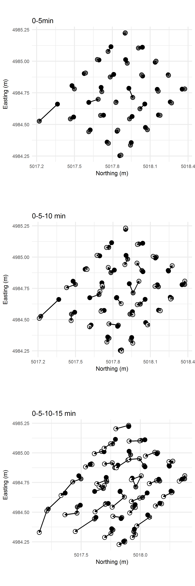

```{r load_libraries, echo = FALSE}
library(knitr)
opts_chunk$set(echo = FALSE, messages = FALSE, warnings = FALSE, dpi = 300)
suppressPackageStartupMessages(library(dplyr, quietly = TRUE))
suppressPackageStartupMessages(library(ggplot2, quietly = TRUE))
suppressPackageStartupMessages(library(gridExtra, quietly = TRUE))
library(readxl)
library(stringr)
library(captioner)
library(grid)
fig_nums <- captioner()
options(warn=-1)
# image width should be 90 mm for 1 col, 140 mm for 1.5 col, 190mm for two cols
```

```{r load_data}
# enter lithic metric data

tramp <- read_excel("../data/trampling_exp.xlsx")

# Load total station data
points <- read.csv("../data/trampling.csv")
```

# Introduction

Claims for the first evidence of human activity at many archaeological sites depend on a close stratigraphic assocation between culturally modified materials and dated materials. This has been a central concern in debates surrounding the timing of the first human occupation of Sahul, where the archaeological deposits are often sandy and lacking well-defined stratigraphy. Investigations at archaeological sites in northern Australia recovered small numbers of flaked stone artefacts from sandy rockshelter deposits associated with Optically Stimulated Lumincence ages 50-60 k BP. The reliability of these associations have been questioned, with critics claiming that post-depositional processes have brought the stone artefacts in association with much older sediments. At Madjebebe (formerly Malakanunja II), one of Australia's oldest sites, trampling of artefacts has been frequently proposed as a possible cause of dislocation of artefacts through down through the deposit into an association with sediments much older than the artefacts. In this paper we describe a trampling experiment directly relevant to Madjebebe and other sites with sandy deposits, such in coastal or desert environments. 

Because of the importance of its effect on the understanding artefact contexts and associations, trampling experiments are a mainstay of archaeological science. For example, Eren et al. [-@eren2010experimental] summarised fourteen publications of trampling experiments, all aimed at understanidng how a human and animal trampling contribute to the spatial  displacement of, and damage to, object commonly found in archaeological sites. The aim of our experiment was to understand how artefacts move in a  sandy deposit when trampled by walking. Specifically, we explored the relationship between artefact shape paramteters and the distance they are moved by trampling. We follow Eren et al. [-@eren2010experimental] in focusing on short-term trampling events, and by record the position, orientation and inclination of the artefacts between each trampling event. 

The design of our experiment includes two novel elements not seen in previous trampling studies. First, the substrate for our trampling experiment was the same sediment as the archaeological site that motivated the experiment. A similar experimental setup was used by Benito-Calvo et al. [-@BenitoCalvo2011trampling], who simulated an archaeological sediment fabric by adding clasts to a nearby non-archaeological deposit. In contrast, we conducted our trampling experiment directly on the the spoil heaps that held archaeological sediment removed during the 2012 excavations at Madjebebe. This adds a degree of realism to our trampling model. Interactions between the experiment artefacts and deposit more faithfully resemble what happened in the archaeological deposit because we used the archaeological sediments as our trampling medium. This ensures a close match for texture and penetrability between the experimental setup and the archaeological site. Our experiment still has many differences from the archaeological contexts, for example we were not able to exactly match the compaction and fabric, or directional properties, of the archaeological deposits. Furthermore, we cannot be sure of the nature of the archaeological sediment at the time the artefacts were deposited and trampled in prehistory, because post-depositional processes have likely altered the However, our field observations were that the spoil heaps closely resembled the structure, cohesiveness, permeability and moisture content of the archaeological deposits at Madjebebe.

Our second novel element is the use of a system for classifying artefact shape that is derived from geological studies of the effect of particle shape on their movement in sediments. Previous studies have used artefact length or mass as a proxy for artefact size to investigate the relationship between size and movement [eg. @Nielsen1991trampling; @GiffordGonzalez1985]. As Eren et al. [-@eren2010experimental] note, previous studies are not unanimous in demonstrating a relationship between artefact size and movement. This may be because length and mass by themselves are not especially sensitive variables when considering artefact movement. In studying the natural movement of clasts on the landscape, sedimentary geologists have developed a number of shape quantification systems to investigate the transport history of sediments and characterize depositional environments [@Oakey2005grainshape; @Woronow992pebbleshape; @Benn1992pebbleshape; @blott2008particle].  We adopted the simplest of these, the Zingg system, to quantify artefact shape and investigate its relationship with movement resulting from trampling.

# Madjedbebe 

Previously known as Malakanunja II, Madjebebe is a sandstone rockshelter at the edge of the Magella floodplain in the Northern Territory, Australia. Archaeological excavations were conducted at Madjebebe in 1973 [@KammingaAllen1973], 1989 [@Roberts1990; @Clarkson2015Madjedbebe], 2012 and 2015. The 1989 excavation produced Thermoluminescence (TL) and Optically Stimulated Luminescence (OSL) ages of 52 $\pm$ 11 and 61 $\pm$ 13 ka associated with the lowest artefacts in the deposit [@Roberts1990]. The nearby site of Nauwalabila returned similar OSL ages, bracketing the ages of the lowest artefacts at between 53 $\pm$ 5 and 60.3 $\pm$ 6 ka [@Roberts1994deaf; @Bird2002Nauwalabila]. These dates were questioned by Hiscock [-@Hiscock1990old] and Bowdler [-@Bowdler1991dates], and later by Allen and O'Connell [-@allen2003colonised] and Allen and O'Connell [-@allen2014both]. We have previously discussed these concerns in detail in Clarkson et al. [-@Clarkson2015Madjedbebe]. Here we focus only on Hiscock's suggestion of the possibility of downward displacement of artefacts into sterile layers through human treadage. 

```{r dates}
dates_1989 <- read.csv("../data/Date_table_from_paper_on_1989_dig.csv")

# function from Clarkson et al 2015 https://github.com/benmarwick/1989-excavation-report-Madjebebe
tidy_chrono_data <- function(dates_1989){

  # clean up depth, where there's a range, get midpoint
  # get depths with ranges, ie nn-nn
  depthwithrange <- as.character(dates_1989$Depth.cm [grepl("-", dates_1989$Depth.cm )])
  # find midpoint
  midpoint <- unlist(lapply(depthwithrange, function(i) abs(eval(parse(text= i)))))/2 + # get half of range
    as.numeric(gsub("-.*", "", depthwithrange)) # depth value
  # replace depth with range with single depth value
  dates_1989$Depth.cm <- as.character(dates_1989$Depth.cm)
  dates_1989$Depth.cm[grep("-", dates_1989$Depth.cm)] <- midpoint
  dates_1989$Depth.m <- as.numeric(dates_1989$Depth.cm)/100 # in meters

  # get the median value from OxCal output
  oxcal_medians <- read.csv("../data/Date_table_from_paper_on_1989_dig_C14_OxCal_output.csv")

  # get lab sample ID for matching
  matching <- c("R_Date", " ")
  oxcal_medians$Name <- gsub(paste(matching, collapse = "|"), "", oxcal_medians$Name)

  # get rid of spaces and convert to same type
  dates_1989$Lab.Code <- as.character(gsub(" ", "", dates_1989$Lab.Code))
  dates_1989$Method <- as.character(gsub(" ", "", dates_1989$Method))

  dates_1989_with_C14_medians <- merge(x = dates_1989,
                                       y = oxcal_medians,
                                       by.x = "Lab.Code",
                                       by.y = "Name",
                                       all = TRUE)
  # remove header row
  dates_1989_with_C14_medians <- dates_1989_with_C14_medians[-1,]

  # in kya
  dates_1989_with_C14_medians$age2plot <- (ifelse(dates_1989_with_C14_medians$Method == "TL"|dates_1989_with_C14_medians$Method == "OSL", dates_1989_with_C14_medians$Uncalibrated.Age, ifelse(dates_1989_with_C14_medians$Method == "C14"| dates_1989_with_C14_medians$Method == "ABOX", as.numeric(as.character(dates_1989_with_C14_medians$X.3)), NA)))/1000

  # simplify object name
  dates_1989 <- dates_1989_with_C14_medians

  return(dates_1989)

}
# do the tidying
dates_1989_tidy <- tidy_chrono_data(dates_1989)

# function from Clarkson et al 2015 https://github.com/benmarwick/1989-excavation-report-Madjebebe
interpolate_chrono_data <- function(dates_1989_tidy, depth_of_interest = 200){

  # interpolate age from loess line with depth
  # this is for the lines that show oldest artefact, etc.
  cal.date.lo <- loess(age2plot ~ Depth.m, dates_1989_tidy[dates_1989_tidy$Method %in% c("C14", "TL", "OSL"),] , span = 0.4) # exclude ABOX dates
  cal.date.pr <- predict(cal.date.lo, data.frame(Depth.m = seq(0, 5, 0.01)))
  # plot(cal.date.pr) # just to check
  cal.date.pr <- data.frame(age = cal.date.pr, depth = names(cal.date.pr))
  # determine an age from a known depth
  oldest_depth = 287 # depth in cm, to the nearest 1 cm: oldest artefacts
  oldest <- cal.date.pr[cal.date.pr$depth == oldest_depth,]$age # returns age from loess
  base_of_dense_depth = 250 # depth in cm, to the nearest 1 cm: base of dense artefacts
  dense <- cal.date.pr[cal.date.pr$depth == base_of_dense_depth,]$age # returns age from loess
   # 200 is 20 cm above 53 ka date at 242 cm bs
  age_at_depth_of_interest <- cal.date.pr[cal.date.pr$depth == depth_of_interest,]$age # returns age from loess
   

  return(list(oldest_depth = oldest_depth,
              oldest = oldest,
              base_of_dense_depth = base_of_dense_depth,
              dense = dense,
              depth_of_interest = depth_of_interest, 
              age_at_depth_of_interest = age_at_depth_of_interest,
              cal.date.lo = cal.date.lo))
}

minimum_age_if_trampled <- interpolate_chrono_data(dates_1989_tidy, depth_of_interest=200)

```

Hiscock cited previous work [eg. @stockton1973shaw] that documented vertical movement of artefacts in the range of 20-40 cm. If movements of this magnitude are common in sandy deposits such as Madjedbebe, then the artefacts associated with the 52 and 61 ka BP dates may have originally been deposited on a much younger occupational surface, and then been displaced downward into older deposits that are unrelated to human occupation. Hiscock's suggestion is that, for example, an artefact at the level of the 52 ka date, 242 cm below the surface, may have originally been deposited during occupation at c. 200 cm below. Using a loess regression on the dates published in Clarkson et al. [-@Clarkson2015Madjedbebe], we can interpolate a calibrated age of `r round(minimum_age_if_trampled$age_at_depth_of_interest, 1)` ka BP for 200 cm below the surface. The difference in age of `r formatC((52 -  round(minimum_age_if_trampled$age_at_depth_of_interest, 0)) * 1000, big.mark=",",format="f", drop0trailing = TRUE)` years between 242 and 200 cm below the surface is substantial, and the ages at each depth have very different implications for the how we interpret the stone artefact assemblage. 

Previously, we reported on two factors that suggest this kind of downward displacement has not been extensive at Madjedbebe [@Clarkson2015Madjedbebe]. First, we noted there there are several artefacts found within the same excavation unit that conjoin. We take these conjoins as evidence that downward displacement has had only a small effect on this assemblage. Second, we showed that there are clear changes in the abundance of raw materials over time. These changes would be heavily obscured if there was substantial downward displacement of artefacts at Madjedbebe. We believe it is unlikely that the all the artefacts associated with the 52 ka date are actually `r round(minimum_age_if_trampled$age_at_depth_of_interest, 1)` ka old, we recognise the potential for movement. However, we recognise the potential for artefact movement at the scale described by Hiscock, and with this experiment we intended to get a better understanding of what components of the lithic assemblage are most suceptible to this kind of downward displacement, and how much of the assemblage was displaced to this extent. 

# Materials and methods 

## Lithic assemblage

We collected nodules of white quartz from the landscape and used hard-hammer direct percussion techniques to remove flakes, following a multi-platform reduction pattern. Quartz nodules occur in the local sandstone scarp formation. Quartz artefacts are abundant in the archaeological deposit, especially in the Holocene levels. We randomly selected 30 flakes for the experiment, spray-painted the artefacts bright orange and numbered them to make them easy to identify after each trampling event. Metric data from the artefacts recovered in 1989 are not available, but we produced the artefacts to be within the size range of the artefacts we were recovering from the 2012 excavations (analysis of these artefacts is in progress). 

## Shape measurement 

The overall shape of a clastic particle, such an artefact, is difficult to conveniently reduce to a single measurement with precision and accuracy. In attempting to summarise an artefact's shape, archaeologists have developed a variety of methods for producing multivariate descriptions of artefact shape in two- and three-dimensions [eg. @Grosman2008threedscanning; @Lycett2006crossbeam]. While these methods have provided insights into reduction strategies and assemblage comparison, they require specialised equipment (such as a three-dimensional scanner or photogrammetry equipment) that was not available to us for our experiment. Instead, we used linear measurements of artefacts obtained with vernier callipers to compute indices of artefact shape. These linear measurements can be used with th Zingg system to summarize artefact shape. Although there is extensive discussion on the question of the best clast shape classification method amongst geologists, there is little agreement [@Woronow992pebbleshape; @blott2008particle]. We chose the Zingg because it is the simplest and most widely used shape classification system for geological clasts. 

```{r zingg_plot_of_artefacts}
# compute Zingg values --------

# calculate Zingg's shape values
tramp$elong <- with(tramp, (`width(mm)` / `length(mm)`))
tramp$flat <- with(tramp, (`thickness(mm)` / `width(mm)`))
tramp$shape <- with(tramp, (elong / flat))

# rename and compute some variables
tramp$vol <- with(tramp, (`length(mm)` * `width(mm)` * `thickness(mm)`))
tramp$volume <- log(tramp$vol)
tramp$elongation <- tramp$elong
tramp$flatness <- tramp$flat
tramp$sphericity <- with(tramp, ((`width(mm)` * `thickness(mm)`)/`length(mm)`^2))^1/3

# plot Zingg values --------

s <- 4 # text size for Zingg's shape

ggplot(tramp[1:30,], aes(flat, elong, label = artefact)) +
  geom_text() +
  geom_vline(xintercept = 0.67) +
  geom_hline(yintercept = 0.67) +
  annotate("text", 
           label = "oblate\n(discoidal)",
           x=0.5, 
           y=0.9, 
           colour = "red") +
  annotate("text", 
           label = "equiaxial\n(spheroidal)", 
           x=0.9,
           y=0.9,
           colour = "red") +
  annotate("text", 
           label = "triaxial\n(bladed)", 
           x=0.5, 
           y=0.5, 
           colour = "red") +
  annotate("text", 
           label = "prolate\n(rod-shaped)", 
           x=0.9, 
           y=0.5,  
           colour = "red") +
  xlim(0,1) +
  ylim(0,1) +  
  xlab("flatness (width/thickness)") +
  ylab("elongation (width/length)") +
  coord_equal(ratio = 1) +
  theme_minimal()

```

`r fig_nums("zingg_plot_of_artefacts", "Zingg Diagram classifying the shape of the experimental artefacts")`

Zingg indices are derived from the measurement of the three principal axes of the approximating tri-axial ellipsoid. The three principal axes are the longest axis (denoted a _a_), the second longest axis perpendicular to the longest axis (_b_), and the third longest axis perpendicular to both _a_ and _b_ (denoted as _c_). These measurements are not oriented with respect to the percussion axis of the artefact. This is because the percussion attributes have little relevance to how the artefact interacts with the sedimentary deposit during trampling. We simply measured the longest axis on the artefact without regard to the flaking attributes, and then the longest axis that is perpendicular to the first axis (the intermediate axis), and then the longest axis perpendicular to that (the short axis). To obtain the Zingg indices for a given artefact, we first determined the directions for principal axes of the artefact, then measured the axes, and finally computed the axis ratios _b_/_a_ (Zingg's elongation ratio) and _c_/_b_ (Zingg's flatness ratio). Zingg's shape factor is elongation divided by flatness. The Zingg classifications of the artefacts used in the trampling experiment are presented in `r fig_nums("zingg_plot_of_artefacts", display = "cite")`.

## Trampling area, setup and events

```{r trampling_area}
# I combined these images in Inkscape
include_graphics("../figures/views_of_trampling_area.png")
```

`r fig_nums("trampling_area", "Views of the trampling area on the excavation spoil heaps.")`

The trampling area was a level surface on the spoil heap of sediment removed during the 2012 excavations at Madjebebe (`r fig_nums("trampling_area", display = "cite")`). After excavation, the sediment was sieved through 7 mm and 3 mm sieves and dumped in a pile where it was stored until the excavation was backfilled. We used shovels to create a level surface on the spoil heap of about three by three meters. We waited until near the end of the excavation so that the trampling experiment could be conducted on sediments removed from the lowest artefact-bearing deposits at Madjebebe. Waiting until the end of the excavation imposed time constraints on the experiment, limiting the scale of our study, because our excavation permit required immediate backfilling at the end of the field season. 

```{r split_by_trampling_event}
# split string from total station point description
# split out the description between dashes or underscores
points$Description <- as.character(points$Description)
points$code <- (strsplit(points$Description, "-|_"))
points$type <- sapply(points$code, "[", 1) 
points$square <- sapply(points$code, "[", 2)
points$run <- sapply(points$code, "[", 3)
points$artefact <- as.numeric(as.character(sapply(points$code, "[", 4)))
# points$coords <- paste(points$Northing, points$Easting, points$Elevation, sep = "-")
points$artefactNum <- sequence(rle(points$Description)$lengths)
# points <- points[,-c(1:4)]

# reshape to put multiple points of one artefact on one line
points.r <- reshape(points, direction = "wide", timevar = "artefactNum", idvar = "Description")

# make separate tables of point data 
# for before, five min, ten min and fifteen min
before <- points.r[points.r$run.1 == "B",]
five <- points.r[points.r$run.1 == "A5",]
ten <- points.r[points.r$run.1 == "A10",]
fifteen <- points.r[points.r$run.1 == "A15",]

# fifteen is missing an artefact, find which one and replace
# sort(fifteen$artefact.1)
# sort(ten$artefact.1)
# fifteen in missing artefact 35, check to see
# points[points$artefact == 35,]
# indeed it is... replace 35 with same data as ten mins
fifteen <- rbind(fifteen, ten[ten$artefact.1 == 35,])

# separate artefacts with one point, two points and four points
before1 <- before[before$code.2 == 'NULL',]
five1 <- five[five$code.2 == 'NULL',]
ten1 <- ten[ten$code.2 == 'NULL',]
fifteen1 <- fifteen[fifteen$code.2 == 'NULL',]

# ten1 does not have 12 artefacts
# sort(five1$artefact.1)
# sort(ten1$artefact.1)
# missing 58, replace with same data as five mins
ten1 <- rbind(ten1, five1[five1$artefact.1 == 58,])


# now two points per artefact
before2 <- before[before$code.2 != 'NULL' & before$code.3 == 'NULL',]
five2 <- five[five$code.2 != 'NULL' & five$code.3 == 'NULL',]
ten2 <- ten[ten$code.2 != 'NULL' & ten$code.3 == 'NULL',]
fifteen2 <- fifteen[fifteen$code.2 != 'NULL' & fifteen$code.3 == 'NULL',]

# ten2 has too many artefacts....
# sort(five2$artefact.1)
# sort(ten2$artefact.1)
# delete artefact 58, not sure why that's there. 
ten2 <- ten2[ten2$artefact.1 != 58,]

# now four points per artefact
before4 <- before[before$code.3 != 'NULL' & before$code.4 != 'NULL',]
five4 <- five[five$code.3 != 'NULL' & five$code.4 != 'NULL',]
ten4 <- ten[ten$code.3 != 'NULL' & ten$code.4 != 'NULL',]
fifteen4 <- fifteen[fifteen$code.3 != 'NULL' & fifteen$code.4 != 'NULL',]

# how many artefacts in the experiment...

# had two points recorded?
two_dims <- five2 %>% summarize(n = n())
# had four points recorded?
four_dims <- five4  %>%   summarize(n = n())
```

```{r close_up_trampling_area}
# I combined these images in Inkscape
include_graphics("../figures/close_up_of_trampling_area.png")
```

`r fig_nums("close_up_trampling_area", "Close-up of trampling area showing the arrangement of artefacts before trampling (left, grid spacing in 10 cm) and after five minutes (right, scale rod bars are 10 cm)")`

The artefacts were arranged on a one meter grid in the centre of the trampling area (`r fig_nums("close_up_trampling_area", display = "cite")`). The artefacts were positioned 10 cm from each other. The location of the artefacts was recorded with a total station after they were placed on the grid, and after each trampling event. Of the thirty artefacts, `r two_dims` were over two centimenters long and recorded using two points at either end of their longest axis. The remaining `r 30 - two_dims` were recorded with a single point at their center of mass. 

Each trampling episode consisted of an adult male walking barefoot at a constant natural slow walking speed. Our subject walked continuously in a clockwise circuit that included the trampling area for five minutes for each event. The walker crossed the trampling area in the same direction each time. At the end of five minutes, we carefully exposed the artefacts in situ with small leaf trowels, and used a total station to record their location, and for the larger ones, orientation and inclination. 

## Trampling substrate

```{r substrate, cache = TRUE}
# read in the particle size data
archaeological_psd <- read.csv("../data/MK2_2015_excavation_lower_sediment_psd.csv")
trampling_psd <- read.csv("../data/MK2_2015_trampling_area_sediment_psd.csv")

# plot together
xaxbreaks <-   c(4000, 2000, 1000, 500, 250, 125, 63, 31, 16, 8, 4, 2, 0.5, 0.12, 0.04)

ggplot() + 
  geom_line(data = archaeological_psd,
            aes(variable, 
                value,
                group = sample.id),
            alpha = 0.3)  + 
  geom_line(data = trampling_psd,
            aes(variable, 
                value),
            size = 1,
            colour = "red") +
  theme_minimal() +
  theme(axis.text.x = element_text(angle = 90, hjust = 1)) +
  scale_x_log10(breaks = xaxbreaks, 
                labels = xaxbreaks) +
  geom_vline(xintercept = c(62, 4), 
             colour = 'grey40',
             size = 1) +
  xlab("Particle Size (um)") +   
  ylab("Percent volume") +
  annotate("text", 
           x=2,    
           y=max(archaeological_psd$value), 
           label = "Clay") +
  annotate("text",
           x=30,  
           y=max(archaeological_psd$value), 
           label = "Silt") +
  annotate("text", 
           x=1900, 
           y=max(archaeological_psd$value), 
           label = "Sand") +
  coord_fixed(ratio = 0.4)

# permutation test for difference in means of trampling sediment to archaeological samples
sediment_samples <- rbind(archaeological_psd, trampling_psd)

library(perm)
perm_test_sediment <- permKS(value ~ sample.id, 
       data = sediment_samples, 
       method = 'exact.mc',
       control = permControl(nmc = 10^4))

# results, so we can use them in the text
perm_test_sediment_CI_1 <- round(perm_test_sediment$p.conf.int[1], 3)
perm_test_sediment_CI_2 <- round(perm_test_sediment$p.conf.int[2], 3)
nmc_pretty <- prettyNum( perm_test_sediment$nmc, big.mark = ",")
```

`r fig_nums("substrate", "Particle size distributions of sediment collected from the trampling area (bold red line) and sediment collected from the archaeological excvation, 3-4 m below the surface")`

The trampling area was a levelled section of the excavation spoil heap. The sediments came from 3-4 m below the surface, and had passed through 7 mm and 3 mm sieves before being dumped on the spoil heap. Although the sediment has been seived, the texture of a sample take from tbe spoil head sediment remains identical to samples taken from the archaeological deposit, 3-4m below the surface (`r fig_nums("substrate", display = "cite")`). A permutation test for significant differences between any of these samples returns a p-value of `r perm_test_sediment$p.value` (99% confidence interval: `r perm_test_sediment_CI_1`-  `r perm_test_sediment_CI_1` estimated from `r nmc_pretty` Monte Carlo replications).

# Results

We have archived the data resulting from the experiment at XXXXX to enable inspection and resuse of our data and methods. To facilitate computational repoducibility according to the principles described in [@Marwick2016repro], we have also included in that compendium the R code used to analyse the data and generate the all results presented here.

```{r prepare_point_data}

####### find the x and y distances between zero and five min ########
# match up the artefacts, then subtract B from A5
# for artefacts plotted with a single point
five1diff <- merge(before1, five1, by = "artefact.1")
# horizontal displacement distance
five1diff$hor <- with(five1diff, sqrt( (Northing.1.y - Northing.1.x)^2 + (Easting.1.y - Easting.1.x)^2 ) )
# vertical displacement distance
five1diff$ver <- with(five1diff, (Elevation.1.y - Elevation.1.x))
# total length of displacement vector
five1diff$tot <- with(five1diff, sqrt( (Northing.1.y - Northing.1.x)^2 + (Easting.1.y - Easting.1.x)^2 + (Elevation.1.y - Elevation.1.x)^2) )
# direction of displacement

# for artefacts plotted with two points
five2diff <- merge(before2, five2, by = "artefact.1")
# get a centre coord for calculating displacements
five2diff$B.centre.N <- apply(cbind(five2diff$Northing.1.x, five2diff$Northing.2.x), 1, mean)
five2diff$B.centre.E <- apply(cbind(five2diff$Easting.1.x, five2diff$Easting.2.x), 1, mean)
five2diff$B.centre.Z <- apply(cbind(five2diff$Elevation.1.x, five2diff$Elevation.2.x), 1, mean)
five2diff$A5.centre.N <- apply(cbind(five2diff$Northing.1.y, five2diff$Northing.2.y), 1, mean)
five2diff$A5.centre.E <- apply(cbind(five2diff$Easting.1.y, five2diff$Easting.2.y), 1, mean)
five2diff$A5.centre.Z <- apply(cbind(five2diff$Elevation.1.y, five2diff$Elevation.2.y), 1, mean)
# horizontal displacement distance
five2diff$hor <- with(five2diff, sqrt( (A5.centre.N - B.centre.N)^2 + (A5.centre.E - B.centre.E)^2 ) )
# vertical displacement distance
five2diff$ver <- with(five2diff, (B.centre.Z - A5.centre.Z))
# total length of displacement vector
five2diff$tot <- with(five2diff, sqrt( (A5.centre.N - B.centre.N)^2 + (A5.centre.E - B.centre.E)^2 + (B.centre.Z - A5.centre.Z)^2) )
# direction of displacement

# for artefacts plotted with four points
five4diff <- merge(before4, five4, by = "artefact.1")
# get a centre coord for calculating displacements
five4diff$B.centre.N <- apply(cbind(five4diff$Northing.1.x, five4diff$Northing.2.x, five4diff$Northing.3.x, five4diff$Northing.4.x), 1, mean)
five4diff$B.centre.E <- apply(cbind(five4diff$Easting.1.x, five4diff$Easting.2.x, five4diff$Easting.3.x, five4diff$Easting.4.x), 1, mean)
five4diff$B.centre.Z <- apply(cbind(five4diff$Elevation.1.x, five4diff$Elevation.2.x, five4diff$Elevation.3.x, five4diff$Elevation.4.x), 1, mean)
five4diff$A5.centre.N <- apply(cbind(five4diff$Northing.1.y, five4diff$Northing.2.y, five4diff$Northing.3.y, five4diff$Northing.4.y), 1, mean)
five4diff$A5.centre.E <- apply(cbind(five4diff$Easting.1.y, five4diff$Easting.2.y, five4diff$Easting.3.y, five4diff$Easting.4.y), 1, mean)
five4diff$A5.centre.Z <- apply(cbind(five4diff$Elevation.1.y, five4diff$Elevation.2.y, five4diff$Elevation.3.y, five4diff$Elevation.4.y), 1, mean)
# horizontal displacement distance
five4diff$hor <- with(five4diff, sqrt( (A5.centre.N - B.centre.N)^2 + (A5.centre.E - B.centre.E)^2 ) )
# vertical displacement distance
five4diff$ver <- with(five4diff, (B.centre.Z - A5.centre.Z))
# total length of displacement vector
five4diff$tot <- with(five4diff, sqrt( (A5.centre.N - B.centre.N)^2 + (A5.centre.E - B.centre.E)^2 + (B.centre.Z - A5.centre.Z)^2) )
# direction of displacement

# summary for zero to five mins
fivehor <- c(five1diff$hor, five2diff$hor, five4diff$hor)
fivever <- c(five1diff$ver, five2diff$ver, five4diff$ver)
fivetot <- c(five1diff$tot, five2diff$tot, five4diff$tot)
fivesum <- data.frame(cbind(fivehor, fivever, fivetot))


####### find the x and y distances between zero and ten min ########
# match up the artefacts, then subtract B from A5
# for artefacts plotted with a single point
ten1diff <- merge(before1, ten1, by = "artefact.1", all.x = FALSE)
# horizontal displacement distance
ten1diff$hor <- with(ten1diff, sqrt( (Northing.1.y - Northing.1.x)^2 + (Easting.1.y - Easting.1.x)^2 ) )
# vertical displacement distance
ten1diff$ver <- with(ten1diff, (Elevation.1.y - Elevation.1.x))
# total length of displacement vector
ten1diff$tot <- with(ten1diff, sqrt( (Northing.1.y - Northing.1.x)^2 + (Easting.1.y - Easting.1.x)^2 + (Elevation.1.y - Elevation.1.x)^2) )
# direction of displacement

# for artefacts plotted with two points
ten2diff <- merge(before2, ten2, by = "artefact.1", all.y = TRUE)
# get a centre coord for calculating displacements
ten2diff$B.centre.N <- apply(cbind(ten2diff$Northing.1.x, ten2diff$Northing.2.x), 1, mean)
ten2diff$B.centre.E <- apply(cbind(ten2diff$Easting.1.x, ten2diff$Easting.2.x), 1, mean)
ten2diff$B.centre.Z <- apply(cbind(ten2diff$Elevation.1.x, ten2diff$Elevation.2.x), 1, mean)
ten2diff$A5.centre.N <- apply(cbind(ten2diff$Northing.1.y, ten2diff$Northing.2.y), 1, mean)
ten2diff$A5.centre.E <- apply(cbind(ten2diff$Easting.1.y, ten2diff$Easting.2.y), 1, mean)
ten2diff$A5.centre.Z <- apply(cbind(ten2diff$Elevation.1.y, ten2diff$Elevation.2.y), 1, mean)
# horizontal displacement distance
ten2diff$hor <- with(ten2diff, sqrt( (A5.centre.N - B.centre.N)^2 + (A5.centre.E - B.centre.E)^2 ) )
# vertical displacement distance
ten2diff$ver <- with(ten2diff, (B.centre.Z - A5.centre.Z))
# total length of displacement vector
ten2diff$tot <- with(ten2diff, sqrt( (A5.centre.N - B.centre.N)^2 + (A5.centre.E - B.centre.E)^2 + (B.centre.Z - A5.centre.Z)^2) )
# direction of displacement

# for artefacts plotted with four points
ten4diff <- merge(before4, ten4, by = "artefact.1")
# get a centre coord for calculating displacements
ten4diff$B.centre.N <- apply(cbind(ten4diff$Northing.1.x, ten4diff$Northing.2.x, ten4diff$Northing.3.x, ten4diff$Northing.4.x), 1, mean)
ten4diff$B.centre.E <- apply(cbind(ten4diff$Easting.1.x, ten4diff$Easting.2.x, ten4diff$Easting.3.x, ten4diff$Easting.4.x), 1, mean)
ten4diff$B.centre.Z <- apply(cbind(ten4diff$Elevation.1.x, ten4diff$Elevation.2.x, ten4diff$Elevation.3.x, ten4diff$Elevation.4.x), 1, mean)
ten4diff$A5.centre.N <- apply(cbind(ten4diff$Northing.1.y, ten4diff$Northing.2.y, ten4diff$Northing.3.y, ten4diff$Northing.4.y), 1, mean)
ten4diff$A5.centre.E <- apply(cbind(ten4diff$Easting.1.y, ten4diff$Easting.2.y, ten4diff$Easting.3.y, ten4diff$Easting.4.y), 1, mean)
ten4diff$A5.centre.Z <- apply(cbind(ten4diff$Elevation.1.y, ten4diff$Elevation.2.y, ten4diff$Elevation.3.y,ten4diff$Elevation.4.y), 1, mean)
# horizontal displacement distance
ten4diff$hor <- with(ten4diff, sqrt( (A5.centre.N - B.centre.N)^2 + (A5.centre.E - B.centre.E)^2 ) )
# vertical displacement distance
ten4diff$ver <- with(ten4diff, (B.centre.Z - A5.centre.Z))
# total length of displacement vector
ten4diff$tot <- with(ten4diff, sqrt( (A5.centre.N - B.centre.N)^2 + (A5.centre.E - B.centre.E)^2 + (B.centre.Z - A5.centre.Z)^2) )
# direction of displacement

# summary for zero to ten mins
tenhor <- c(ten1diff$hor, ten2diff$hor, ten4diff$hor)
tenver <- c(ten1diff$ver, ten2diff$ver, ten4diff$ver)
tentot <- c(ten1diff$tot, ten2diff$tot, ten4diff$tot)
tensum <- data.frame(cbind(tenhor, tenver, tentot))


####### find the x and y distances between zero and fifteen min ########
# match up the artefacts, then subtract B from A5
# for artefacts plotted with a single point
fifteen1diff <- merge(before1, fifteen1, by = "artefact.1")
# horizontal displacement distance
fifteen1diff$hor <- with(fifteen1diff, sqrt( (Northing.1.y - Northing.1.x)^2 + (Easting.1.y - Easting.1.x)^2 ) )
# vertical displacement distance
fifteen1diff$ver <- with(fifteen1diff, (Elevation.1.y - Elevation.1.x))
# total length of displacement vector
fifteen1diff$tot <- with(fifteen1diff, sqrt( (Northing.1.y - Northing.1.x)^2 + (Easting.1.y - Easting.1.x)^2 + (Elevation.1.y - Elevation.1.x)^2) )
# direction of displacement

# for artefacts plotted with two points
fifteen2diff <- merge(before2, fifteen2, by = "artefact.1")
# get a centre coord for calculating displacements
fifteen2diff$B.centre.N <- apply(cbind(fifteen2diff$Northing.1.x, fifteen2diff$Northing.2.x), 1, mean)
fifteen2diff$B.centre.E <- apply(cbind(fifteen2diff$Easting.1.x, fifteen2diff$Easting.2.x), 1, mean)
fifteen2diff$B.centre.Z <- apply(cbind(fifteen2diff$Elevation.1.x, fifteen2diff$Elevation.2.x), 1, mean)
fifteen2diff$A5.centre.N <- apply(cbind(fifteen2diff$Northing.1.y, fifteen2diff$Northing.2.y), 1, mean)
fifteen2diff$A5.centre.E <- apply(cbind(fifteen2diff$Easting.1.y, fifteen2diff$Easting.2.y), 1, mean)
fifteen2diff$A5.centre.Z <- apply(cbind(fifteen2diff$Elevation.1.y, fifteen2diff$Elevation.2.y), 1, mean)
# horizontal displacement distance
fifteen2diff$hor <- with(fifteen2diff, sqrt( (A5.centre.N - B.centre.N)^2 + (A5.centre.E - B.centre.E)^2 ) )
# vertical displacement distance
fifteen2diff$ver <- with(fifteen2diff, (B.centre.Z - A5.centre.Z))
# total length of displacement vector
fifteen2diff$tot <- with(fifteen2diff, sqrt( (A5.centre.N - B.centre.N)^2 + (A5.centre.E - B.centre.E)^2 + (B.centre.Z - A5.centre.Z)^2) )
# direction of displacement

# for artefacts plotted with four points
fifteen4diff <- merge(before4, fifteen4, by = "artefact.1")
# get a centre coord for calculating displacements
fifteen4diff$B.centre.N <- apply(cbind(fifteen4diff$Northing.1.x, fifteen4diff$Northing.2.x, fifteen4diff$Northing.3.x, fifteen4diff$Northing.4.x), 1, mean)
fifteen4diff$B.centre.E <- apply(cbind(fifteen4diff$Easting.1.x, fifteen4diff$Easting.2.x, fifteen4diff$Easting.3.x, fifteen4diff$Easting.4.x), 1, mean)
fifteen4diff$B.centre.Z <- apply(cbind(fifteen4diff$Elevation.1.x, fifteen4diff$Elevation.2.x, fifteen4diff$Elevation.3.x, fifteen4diff$Elevation.4.x), 1, mean)
fifteen4diff$A5.centre.N <- apply(cbind(fifteen4diff$Northing.1.y, fifteen4diff$Northing.2.y, fifteen4diff$Northing.3.y, fifteen4diff$Northing.4.y), 1, mean)
fifteen4diff$A5.centre.E <- apply(cbind(fifteen4diff$Easting.1.y, fifteen4diff$Easting.2.y, fifteen4diff$Easting.3.y, fifteen4diff$Easting.4.y), 1, mean)
fifteen4diff$A5.centre.Z <- apply(cbind(fifteen4diff$Elevation.1.y, fifteen4diff$Elevation.2.y, fifteen4diff$Elevation.3.y, fifteen4diff$Elevation.4.y), 1, mean)
# horizontal displacement distance
fifteen4diff$hor <- with(fifteen4diff, sqrt( (A5.centre.N - B.centre.N)^2 + (A5.centre.E - B.centre.E)^2 ) )
# vertical displacement distance
fifteen4diff$ver <- with(fifteen4diff, (B.centre.Z - A5.centre.Z))
# total length of displacement vector
fifteen4diff$tot <- with(fifteen4diff, sqrt( (A5.centre.N - B.centre.N)^2 + (A5.centre.E - B.centre.E)^2 + (B.centre.Z - A5.centre.Z)^2) )
# direction of displacement

# summary for zero to fifteen mins
fifteenhor <- c(fifteen1diff$hor, fifteen2diff$hor, fifteen4diff$hor)
fifteenver <- c(fifteen1diff$ver, fifteen2diff$ver, fifteen4diff$ver)
fifteentot <- c(fifteen1diff$tot, fifteen2diff$tot, fifteen4diff$tot)
fifteensum <- data.frame(cbind(fifteenhor, fifteenver, fifteentot))

```

## Horizonal displacement

```{r hor_disp}
# plots for 5, 10 , 15, three plots, side by side

s <- 4.5 # point size
a <- 0.2 # arrow size

### plot hor displ starting locations ### 

plot_starting_location <- ggplot() + 
   ## five minutes
  # artefacts with one point
  geom_point(colour = "black", # start
             fill = "black",
             size = I(s),
             data = five1diff, 
             aes(Northing.1.x,  Easting.1.x),
             pch = 21) +
  
   # artefacts with two points
  geom_point(colour = "black", # start
             fill = "black",
             size = I(s), 
             data = five2diff, 
             aes(B.centre.N,  B.centre.E),
             pch = 21) +
  
    # artefacts with four points
  geom_point(colour = "black", # start
             fill = "black",
             size = I(s), 
             data = five4diff, 
             aes(B.centre.N,  B.centre.E),
             pch = 21) +
  
  coord_equal() + 
  # plot options
  ylab("Easting (m)") +
  xlab("Northing (m)")  +
  theme_minimal(base_size = 12)
  
  
plot_hor_5_min <- function(fill_5m = "grey40"){ 
  
  plot_starting_location +
 
  geom_point(colour = "black", # 5 min
             fill = fill_5m,
             size = I(s), 
             data = five1diff, 
             aes(Northing.1.y,  Easting.1.y),
             pch = 21) +

 # artefacts with two points
  geom_point(colour = "black", # 5 min
             fill = fill_5m,
             size = I(s), 
             data = five2diff, 
             aes(A5.centre.N,  A5.centre.E),
             pch = 21) +
  
 # artefacts with four points
  geom_point(colour = "black",  # end
             fill = fill_5m,
             size = I(s), 
             data = five4diff, 
             aes(A5.centre.N,  A5.centre.E),
             pch = 21) +

  ## arrows to link the artefacts' positions: zero to five
  geom_segment(aes(x =    five1diff$Northing.1.x, 
                   y =    five1diff$Easting.1.x, 
                   xend = five1diff$Northing.1.y, 
                   yend = five1diff$Easting.1.y), 
               arrow = arrow(length = unit(a, "cm")), 
               size=1, color="black") +
  geom_segment(aes(x =    five2diff$B.centre.N, 
                   y =    five2diff$B.centre.E, 
                   xend = five2diff$A5.centre.N, 
                   yend = five2diff$A5.centre.E), 
               arrow = arrow(length = unit(a, "cm")), 
               size=1, color="black") +
  geom_segment(aes(x =    five4diff$B.centre.N, 
                   y =    five4diff$B.centre.E, 
                   xend = five4diff$A5.centre.N, 
                   yend = five4diff$A5.centre.E), 
               arrow = arrow(length = unit(a, "cm")), 
               size=1, color="black") 
}


### plot hor displ after 5 and 10  min ### 
plot_hor_10_min <- function(fill_5m = "grey40", fill_10m = "grey80"){
  
   plot_hor_5_min(fill_5m = fill_5m) +
  
  ## ten minutes
  # artefacts with one point
  geom_point(colour = "black",
             fill = "black",
             size = I(s), 
             data = ten1diff, 
             aes(Northing.1.x,  Easting.1.x),
             pch = 21) +
  geom_point(colour = "black", 
             fill = fill_10m,
             size = I(s), 
             data = ten1diff, 
             aes(Northing.1.y,Easting.1.y),
              pch = 21) +
  
  # artefacts with two points
  geom_point(colour = "black",
             fill = "black",
             size = I(s), 
             data = ten2diff, 
             aes(B.centre.N,  B.centre.E),
             pch = 21) +
  geom_point(colour = "black", 
             fill = fill_10m,
             size = I(s), 
             data = ten2diff, 
             aes(A5.centre.N,  A5.centre.E), 
             pch = 21) +

  # artefacts with four points
  geom_point(colour = "black", 
             fill = "black",
             size = I(s), 
             data = ten4diff, 
             aes(B.centre.N,  
                 B.centre.E)) +
  geom_point(colour = "black", 
             fill = fill_10m,
             size = I(s), 
             data = ten4diff, 
             aes(A5.centre.N,  A5.centre.E),
             pch = 21) +
    
      ## arrows to link the artefacts' positions: five to ten
  geom_segment(aes(xend = ten1diff$Northing.1.y, 
                   yend = ten1diff$Easting.1.y, 
                   x =    five1diff$Northing.1.y, 
                   y =    five1diff$Easting.1.y), 
               arrow = arrow(length = unit(a, "cm")), 
               size=1, 
               color="black") +
                                      
  geom_segment(aes(xend = ten2diff$A5.centre.N, 
                   yend = ten2diff$A5.centre.E, 
                   x =    five2diff$A5.centre.N, 
                   y =    five2diff$A5.centre.E), 
               arrow = arrow(length = unit(a, "cm")), 
               size=1, 
               color="black") +
  geom_segment(aes(xend = ten4diff$A5.centre.N, 
                   yend = ten4diff$A5.centre.E, 
                   x =    five4diff$A5.centre.N, 
                   y =    five4diff$A5.centre.E), 
               arrow = arrow(length = unit(a, "cm")), 
               size=1, 
               color="black")
}
  
### plot hor displ after 5 and 10 and 15 min ### 
plot_hor_15_min <- function(fill_5m = "grey40", fill_10m = "grey80", fill_15m = "white"){  
  
  plot_hor_10_min(fill_5m = fill_5m,
                  fill_10m = fill_10m) +
    
  ## fifteen minutes
  # artefacts with one point
  geom_point(colour = "black", 
             fill = "black",
             size = I(s), 
             data = fifteen1diff, 
             aes(Northing.1.x,  Easting.1.x),
             pch = 21) +
  geom_point(colour = "black", 
             fill = fill_15m,
             size = I(s), 
             data = fifteen1diff, 
             aes(Northing.1.y,  Easting.1.y),
             pch = 21) +

  # artefacts with two points
  geom_point(colour = "black", 
             fill = "black",
             size = I(s), 
             data = fifteen2diff, 
             aes(B.centre.N,  B.centre.E),
             pch = 21) +
  geom_point(colour = "black", 
             size = I(s), 
             fill = fill_15m,
             data = fifteen2diff, 
             aes(A5.centre.N,  A5.centre.E),
             pch = 21) +
  
  # artefacts with four points
  geom_point(colour = "black", 
             fill= "black",
             size = I(s), 
             data = fifteen4diff, 
             aes(B.centre.N,  B.centre.E),
             pch = 21) +
  geom_point(colour = "black", 
             fill = fill_15m,
             size = I(s), 
             data = fifteen4diff, 
             aes(A5.centre.N,  A5.centre.E),
             pch = 21) +
                     
  ## arrows to link the artefacts' positions: ten to fifteen
  geom_segment(aes(xend = fifteen1diff$Northing.1.y, 
                   yend = fifteen1diff$Easting.1.y, 
                   x =    ten1diff$Northing.1.y, 
                   y =    ten1diff$Easting.1.y), 
               arrow = arrow(length = unit(a, "cm")), 
               size=1, 
               color="black") +
                                        
  geom_segment(aes(xend = fifteen2diff$A5.centre.N, 
                   yend = fifteen2diff$A5.centre.E, 
                   x =    ten2diff$A5.centre.N, 
                   y =    ten2diff$A5.centre.E), 
               arrow = arrow(length = unit(a, "cm")), 
               size=1, 
               color="black") +
  geom_segment(aes(xend = fifteen4diff$A5.centre.N, 
                   yend = fifteen4diff$A5.centre.E, 
                   x =    ten4diff$A5.centre.N, 
                   y =    ten4diff$A5.centre.E), 
               arrow = arrow(length = unit(a, "cm")), 
               size=1, 
               color="black") 
  
}


plot1 <- plot_hor_5_min()  + ggtitle("0-5min") 
plot2 <- plot_hor_10_min() + ggtitle("0-5-10 min")
plot3 <- plot_hor_15_min() + ggtitle("0-5-10-15 min")

            
g <- arrangeGrob(plot1, plot2, plot3, nrow=3) #generates g
# grid.draw(g)
ggsave(file="../figures/horizontal_plots.png", g,
       width = 6, height = 18,
       dpi = 300)
```

```{r show_hor_disp_plot}

```

`r fig_nums("hor_disp", "Plots of horizontal displacement of artefacts after 5, 10 and 15 minutes of trampling.")`

```{r hor_displ_dists}
# plot distribution of horizontal displacements after 5-10-15
hor <- data.frame(artefact = c(five1diff$artefact.1, five2diff$artefact.1, five4diff$artefact.1), five = fivesum$fivehor, ten = tensum$tenhor, fifteen = fifteensum$fifteenhor)

hor.s <- stack(hor[,c(2:4)])
hor.s$ind = reorder(hor.s$ind, hor.s$values, mean)
# plot
ggplot(hor.s, 
       aes(ind, values)) + 
  geom_boxplot(outlier.colour = "white") + 
  geom_jitter(alpha = 0.4, 
              width = 0.4,
              size = 3) +
  theme_minimal(base_size = 14) +
  ylab("Meters from start position") +
  xlab("")
```

`r fig_nums("hor_displ_dists", "Distributions of horizontal displacements of artefacts after 5, 10 and 15 minutes of trampling.")`

```{r hor_directions}
# start locations
start_coords <- 
do.call(rbind, list(cbind(five1diff$Northing.1.x, 
                          five1diff$Easting.1.x), 
                    cbind(five2diff$B.centre.N, 
                          five2diff$B.centre.E),
                    cbind(five4diff$B.centre.N, 
                          five4diff$B.centre.E)))

# end locations
end_coords <- 
  do.call(rbind, list(cbind(fifteen1diff$Northing.1.y,
                            fifteen1diff$Easting.1.y),
                      cbind(fifteen2diff$Northing.1.y,
                            fifteen2diff$Easting.1.y),
                      cbind(fifteen4diff$Northing.1.y,
                            fifteen4diff$Easting.1.y)))

# set end coords so that start is 0,0
zero_origin <- end_coords - start_coords

# compute angle of displacement, as 0-360 deg
angle_hor_displacement <- atan2(zero_origin[,1], zero_origin[,2]) / (pi/180)
angle_hor_displacement <- ifelse(angle_hor_displacement < 0, 360 + angle_hor_displacement, angle_hor_displacement)
  
# plot
p <- ggplot() +
  geom_histogram(aes(x = angle_hor_displacement), 
                 colour = "black", 
                 fill = "grey80") +
  theme(axis.text.x = element_text(size = 18)) +
  coord_polar(start = 0) +
  scale_x_continuous(limits = c(0, 360), breaks = c(0, 90, 180, 270)) +
  theme_minimal(base_size = 14) +
  xlab("")
# don't want that message about stat_bin!
suppressMessages(print(p))

```

`r fig_nums("hor_directions", "Histogram of directions of displacement of artefacts from their starting positions to their locations after fifteen minutes of trampling")`

```{r hor_directions_model}
# get artefact IDs in order

angle_hor_displacement_df <- 
  data.frame(artefact = c(five1diff$artefact.1,
                    five2diff$artefact.1,
                    five4diff$artefact.1),
             angle_hor_displacement = angle_hor_displacement)
# combine with Zingg data
hor_dir_artefact <- merge(angle_hor_displacement_df, tramp, by = "artefact")

# apply a linear model on 15 min dir and a bunch of size and shape variables
suppressPackageStartupMessages(library(purrr))
library(broom)
vars_of_interest <-  c("length(mm)",
                      "width(mm)",
                      "thickness(mm)",
                      "volume",
                      "elongation",
                      "flatness",
                      "shape",
                      "sphericity")


library(tidyr)
# summarise multiple models
linear_models_estimates_dir <- 
hor_dir_artefact %>% 
  gather(value, 
         variable, 
         -angle_hor_displacement) %>% 
  filter(value %in% vars_of_interest) %>% 
  group_by(value) %>% 
  do(cbind(tidy(lm(scale(angle_hor_displacement) ~ scale(variable), data = .), 
          conf.int=TRUE),
          glance(lm(scale(angle_hor_displacement) ~ scale(variable), data = .)))) %>% 
  mutate(low = estimate - std.error,
        high = estimate + std.error) %>% 
  filter(term != "(Intercept)") %>% 
  ungroup %>% 
  mutate(value = gsub("\\(mm\\)", "", value))

# plot
library(ggrepel)
ggplot(linear_models_estimates_dir, 
        aes(estimate, 
            adj.r.squared,
            xmin = low, 
            xmax = high, 
            height = 0)) +
    geom_point(data = linear_models_estimates_dir[linear_models_estimates_dir$p.value > 0.05,],
        aes(estimate, 
            adj.r.squared,
            size = 1/p.value)) +
    # geom_point(data = linear_models_estimates_dir[linear_models_estimates_dir$p.value < 0.05,],
    #     aes(estimate, 
    #         adj.r.squared,
    #         size = 1/p.value),
    #         pch = 21) +
    geom_vline(xintercept = 0) +
    geom_errorbarh() +
    geom_text_repel(aes(estimate, 
            adj.r.squared,
            label = value),
            nudge_x = 0.015,
            nudge_y = 0.01) +
   theme_minimal() +
   xlab("Standardised estimates with 95% confidence intervals") +
   ylab(expression(Adjusted~R^2)) +
   scale_size("p-values", 
                         breaks = c(1/0.75, 1/0.25, 1/0.05, 1/0.01), 
                         labels = c(0.75, 0.25, 0.05, 0.01))
   
```

`r fig_nums("hor_models_dir", "Linear models for a variety of predictors of the direction of horizontal displacement after fifteen minutes of trampling. None of the models have p < 0.05. Positive estimate values indicate positive correlations.")`

```{r hor_models}
hor_disp_artefact <- merge(hor, tramp, by = "artefact")

# reshape to long, keeping the 15 mist hor dist out
library(tidyr)
hor_disp_artefact_long <- gather(hor_disp_artefact, 
                                 value, variable, 
                                 -fifteen)
# apply a linear model on 15 min disp and a bunch of size and shape variables
suppressPackageStartupMessages(library(purrr))
library(broom)
vars_of_interest <-  c("length(mm)",
                      "width(mm)",
                      "thickness(mm)",
                      "volume",
                      "elongation",
                      "flatness",
                      "shape",
                      "sphericity")

# plot
library(ggrepel)


# another way to summarise multiple models
linear_models_estimates <- 
hor_disp_artefact_long %>% 
  filter(value %in% vars_of_interest) %>% 
  group_by(value) %>% 
  do(cbind(tidy(lm(scale(fifteen) ~ scale(variable), data = .), 
          conf.int=TRUE),
          glance(lm(scale(fifteen) ~ scale(variable), data = .)))) %>% 
  mutate(low = estimate - std.error,
        high = estimate + std.error) %>% 
  filter(term != "(Intercept)") %>% 
  ungroup %>% 
  mutate(value = gsub("\\(mm\\)", "", value))


ggplot(linear_models_estimates, 
        aes(estimate, 
            adj.r.squared,
            xmin = low, 
            xmax = high, 
            height = 0)) +
    geom_point(data = linear_models_estimates[linear_models_estimates$p.value > 0.05,],
        aes(estimate, 
            adj.r.squared,
            size = 1/p.value)) +
    geom_point(data = linear_models_estimates[linear_models_estimates$p.value < 0.05,],
        aes(estimate, 
            adj.r.squared,
            size = 1/p.value),
            pch = 21) +
    geom_vline(xintercept = 0) +
    geom_errorbarh() +
    geom_text_repel(aes(estimate, 
            adj.r.squared,
            label = value),
            nudge_x = 0.02,
            nudge_y = 0.02) +
   theme_minimal() +
   xlab("Standardised estimates with 95% confidence intervals") +
   ylab(expression(Adjusted~R^2)) +
   scale_size("p-values", 
                         breaks = c(1/0.75, 1/0.25, 1/0.05, 1/0.01), 
                         labels = c(0.75, 0.25, 0.05, 0.01))
   
```

`r fig_nums("hor_models", "Linear models for a variety of predictors of horizontal displacement after fifteen minutes of trampling. Hollow data points indicate p < 0.05. Positive estimate values indicate positive correlations.")`

```{r hor_summary}
rounding <- 3
hor_min <-       round(min(hor_disp_artefact$fifteen), rounding)
hor_max <-       round(max(hor_disp_artefact$fifteen),  rounding)
hor_median <-    round(median(hor_disp_artefact$fifteen), rounding)
hor_mad <-       round(mad(hor_disp_artefact$fifteen),rounding)
```

`r fig_nums("hor_disp", display = "cite")` shows maps of the horizontal displacement of artefacts after five, ten and fifteen minutes. A variety of trajectories are visible, with some artefacts moving in a relatively straight line, others changing angle at each move, and one returning almost exactly to its start position. `r fig_nums("hor_directions", display = "cite")` shows that after fifteen minutes, most artefacts have are in a location opposite to the direction of walking across the area. None of the Zingg shape variables are effective predictors of the direction of horizontal displacement (`r fig_nums("hor_models_dir", display = "cite")`).

`r fig_nums("hor_displ_dists", display = "cite")` shows the distributions of dsiplacements from each artefact's starting position after each trampling interval. After fifteen minutes, the total horizontal displacement of all artefacts varied from `r hor_min` m to `r hor_max` m with a median of `r hor_median` m, and median absolute deviation (a robust measure of variation) of `r hor_mad` m. `r fig_nums("hor_models", display = "cite")` provides a graphical summary of linear regression models to identify how well the Zingg shape attributes predict the amount of horizontal displacement for each artefact after fifteen minutes of trampling. Shape and elongation are the strongest predictors of horizontal displacement. The elongation relationship indicates that as width increases relative to length, the artefacts are more likely to be moved a longer distance by trampling. The shape relationship suggests that as artefacts are more equidimensional, they tend to be moved horizontally further by trampling. 

## Vertical displacement 

```{r ver_disp}

# plot distribution of vertical displacements after 5-10-15
ver <- data.frame(artefact = c(five1diff$artefact.1, 
                               five2diff$artefact.1, 
                               five4diff$artefact.1), 
                  five = fivesum$fivever, 
                  ten = tensum$tenver, 
                  fifteen = fifteensum$fifteenver)

# to long format
ver.s <- stack(ver[,c(2:4)])

# reorder so we get the x-axis looking sensible
ver.s$ind = factor(ver.s$ind, levels = c("five", "ten", "fifteen"))

# plot
ggplot(ver.s, aes(ind, values)) + 
  geom_boxplot(outlier.colour = "white") + 
  geom_jitter(alpha = 0.4, 
              width = 0.4,
              size = 3) +
  theme_minimal(base_size = 16) +
  xlab("trampling episode (mins)") + 
  ylab("displacement (m)")

```

`r fig_nums("ver_disp", "Distributions of vertical displacements of artefacts after 5, 10 and 15 minutes of trampling. Negative values indicate that the artefact is below its starting location.")`

```{r ver_summary}
rounding <- 3
ver.s %>% 
  group_by(ind) %>% 
  summarise(ver_min =      round(min(values), rounding),
            ver_max =      round(max(values), rounding),
            ver_median =   round(median(values), rounding),
            ver_mad =      round(mad(values), rounding),
            ver_min =      round(min(values), rounding),
            ver_max =      round(max(values), rounding),
            ver_median =   round(median(values),rounding),
            ver_mad =      round(mad(values), rounding))
```


## Inclination

Discussion and Conclusion

References 


